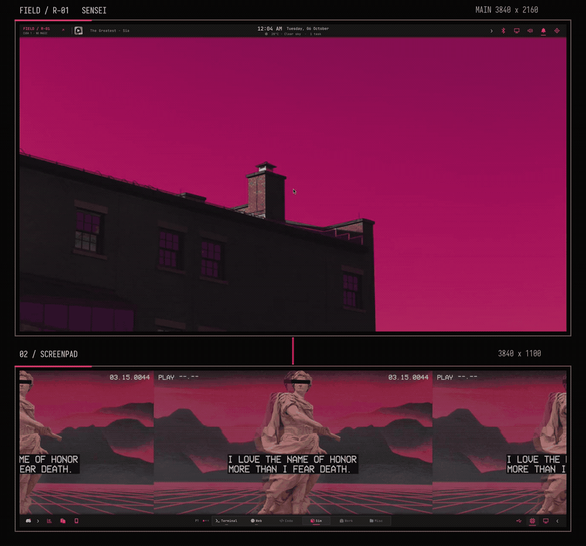
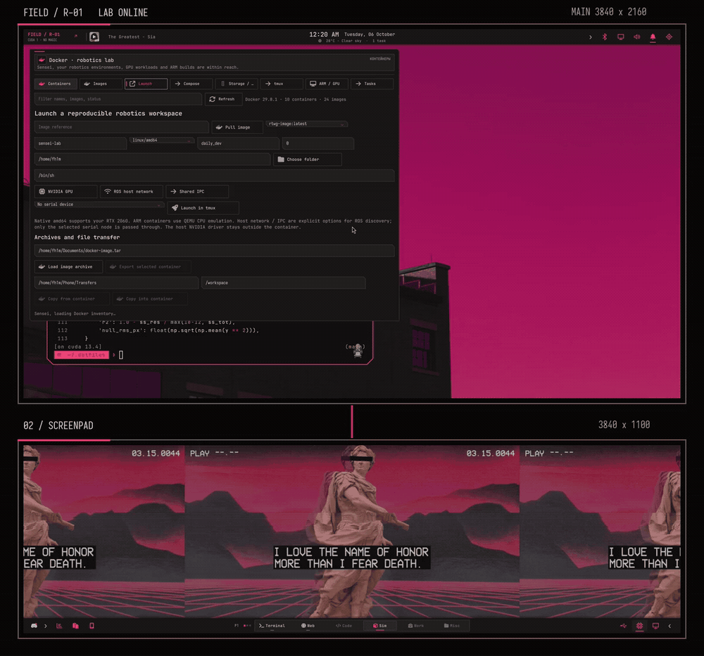
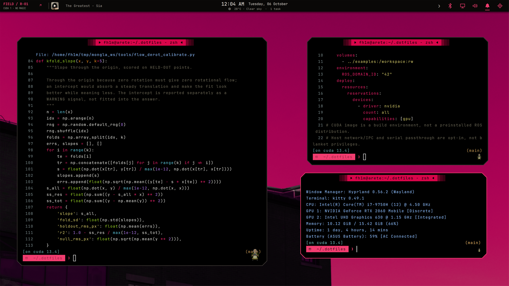
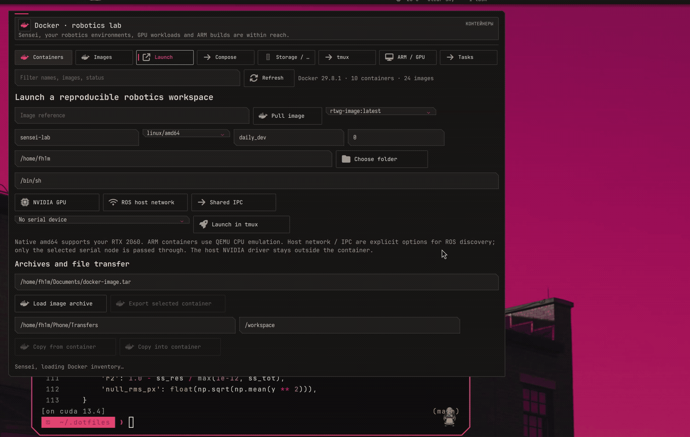
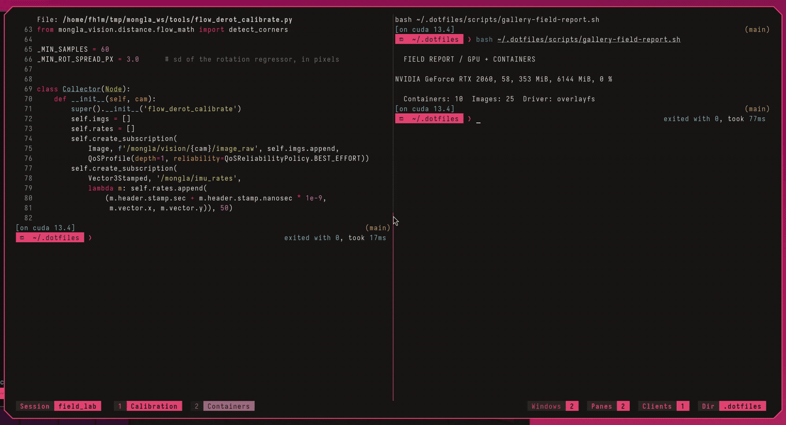
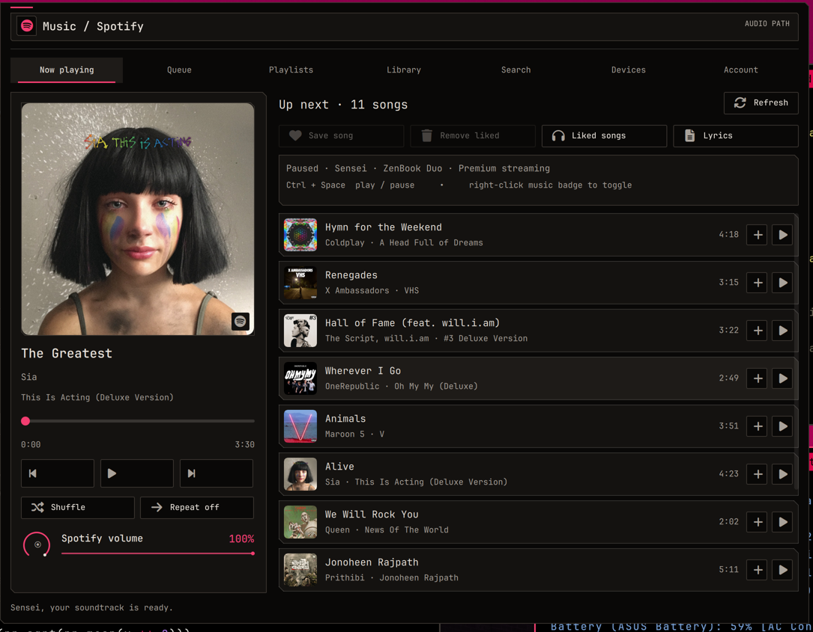
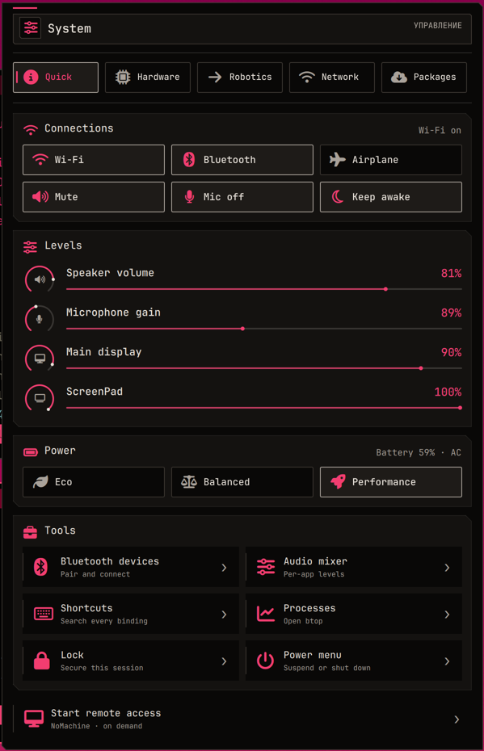
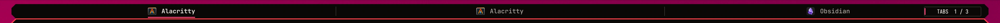

<div align="center">

<sub>FH1M / FIELD R-01</sub>

<h1>Sensei Robotics Workstation</h1>

<p>Two screens. Two GPUs. One opinionated workbench.</p>

<picture><source media="(prefers-reduced-motion: reduce)" srcset="docs/assets/duo-hero.png"></picture>

<sub>THE MAIN CANVAS ↑ &nbsp;·&nbsp; THE SCREENPAD ↓ &nbsp;·&nbsp; <a href="docs/assets/duo-hero.mp4">WATCH THE MP4</a></sub>

[](docs/installation.md) [](home/.config/quickshell/wrayth) [](docs/hardware-and-boot.md) [](docs/gpu-and-chrome.md) [](docs/robotics.md) [](LICENSE)

[Install](docs/installation.md) · [Gallery](docs/gallery.md) · [Keybinds](docs/keybindings.md) · [Robotics lab](docs/robotics.md) · [Performance](docs/performance.md) · [Recovery](docs/operations.md)

</div>

## Two displays, one desk

<p align="center"><picture><source media="(prefers-reduced-motion: reduce)" srcset="docs/assets/duo-lab.png"></picture></p>

<sub>MAIN // ARM + CUDA LAB &nbsp;↓&nbsp; SCREENPAD // MONITOR + USB · [MP4](docs/assets/duo-lab.mp4) · [Empty main](docs/assets/desktop-empty-main.png) · [Tiled ScreenPad](docs/assets/desktop-empty-screenpad.png)</sub>

## Code in the foreground, lab one click away



<sub>[Mongla’s held-out optical-flow calibration](https://github.com/fh1m/mongla_ws/blob/main/tools/flow_derot_calibrate.py) · [CUDA/ARM Compose recipe](examples/compose.robotics.yaml). Actual files, not terminal wallpaper.</sub>



<sub>Docker / ARM / CUDA / tmux · [MP4](docs/assets/robotics-lab.mp4) · [Lab guide](docs/robotics.md)</sub>

## The terminal remembers



<sub>Alacritty + Iosevka + persistent tmux. Sessions survive the window; the status line tells you where you landed. [Full-size still](docs/assets/tmux-field-lab.png) · [MP4](docs/assets/tmux-field-lab.mp4) · [Terminal guide](docs/terminal.md)</sub>

## Small windows, useful jobs



<sub>Music // album art, queue, library, devices, lyrics. [Audio notes](docs/audio-and-spotify.md)</sub>

<p align="center"></p>

<sub>System // controls, hardware, robotics, network, packages.</sub>



<sub>Alacritty ⇄ Obsidian. Native Hyprland tabs, inside the window silhouette. [Keybinds](docs/keybindings.md)</sub>

<details><summary>More panels, code, and a very serious comic</summary>

[Every widget, full-size](docs/gallery.md) · [Mongla code close-up](docs/assets/mongla-code.png) · [XKCD intermission](docs/assets/comic.png) · [Phone bridge](docs/phone.md) · [Audio route](docs/audio-and-spotify.md)

</details>

## Numbers before adjectives

| Measured on this machine | Why it matters |
|---|---|
| **22.6% → 6.6%** Intel render share | Alacritty replaced Kitty for the same animated terminal test. |
| **286/s → 0/s** unused ScreenPad I²C interrupts | Disabled touch-controller noise; display and brightness still work. |
| **0.225%** NVMe busy in an apparent “I/O stall” | The bottleneck was Intel display fences, not the SSD. |

*Workload samples, not universal benchmarks.* [Methods and limits](docs/performance.md). Built for an [ASUS ZenBook Pro Duo UX581GV](docs/hardware-and-boot.md); the starting spark was [Wrayth by bowenbride](https://github.com/bowenbride/wrayth). [Credits](THIRD_PARTY.md).

## Bring your own workbench

```sh
git clone https://github.com/fh1m/.dotfiles.git ~/.dotfiles
cd ~/.dotfiles
python3 scripts/install.py                 # preview
python3 scripts/install.py --apply         # backs up user files
bash scripts/build-native.sh
python3 scripts/doctor.py
```

[Read the install guide](docs/installation.md) before applying the UX581GV display preset. Credentials, browser profiles, device pairings, and clipboard history stay out of this repo.

### Noesis — learn anything, build something

Subject vaults, small prerequisite gates, real experiments and reconstructive reviews.
Obsidian holds the evidence; Neovim stays the workbench. [Learning workflow →](docs/learning-system/README.md) · [Native UI gallery →](docs/learning-system/ui-gallery.md)
