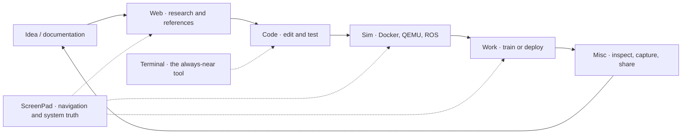

<div align="center">


**A robotics workstation that feels like home.**

Hyprland · Quickshell · Arch / CachyOS · Intel + NVIDIA · dual-panel ZenBook

[](LICENSE)
[](docs/installation.md)
[](home/.config/quickshell/wrayth)
[](https://github.com/fh1m)

[Install](docs/installation.md) · [Gallery](docs/gallery.md) · [Design story](docs/design-story.md) · [GPU & Chrome](docs/gpu-and-chrome.md) · [Robotics](docs/robotics.md) · [Recovery](docs/operations.md) · [Validation](docs/validation.md)

</div>

## Come into the den

<p align="center"><sub>01 / MAIN DISPLAY · 3840 × 2160 · TOP FLIGHT STRIP</sub><br><br><sub>↓ the ScreenPad sits directly beneath it ↓</sub><br><br><sub>02 / SCREENPAD · 3840 × 1100 · BOTTOM TOOL STRIP</sub></p>

> I wanted a desktop for building robots, reading documentation, training models and listening to music — with the controls I use close at hand. The ScreenPad should be useful, the GPU should have a purpose, and a pretty interface should not get in the way of work. This is that personal daily driver, shaped around my ZenBook Pro Duo and my way of working.

**Two real displays, captured empty before the showcase terminals opened.** The upper panel is a large, quiet canvas. The lower panel keeps navigation and diagnostics in sight without taking a line away from code. The red and blue are from the wallpapers themselves; the shell's cut-corner bars deliberately leave most of that art visible.

| 02 displays | 06 named spaces | 01 operator | 00 reasons for a fake benchmark |
|:---:|:---:|:---:|:---:|
| main + ScreenPad | Terminal · Web · Code · Sim · Work · Misc | **Sensei** | the figures below come from this laptop |

This began as a GNOME → Hyprland migration on CachyOS. It became a hardware investigation and a purpose-built shell: six named workspaces, separate bars for separate displays, native Spotify controls, a persistent clipboard, deep system and USB inspection, a phone bridge, and a Docker robotics lab.

**The starting point is [Wrayth by bowenbride](https://github.com/bowenbride/wrayth).** Its shell, deck, helpers and cut-corner language are retained and extensively adapted. Credit belongs to the original project; see [provenance and licenses](THIRD_PARTY.md). The additions and hardware decisions here belong to this workstation.

## From blank canvas to working day


The main panel now has actual [ROS 2 heartbeat source](examples/robotics-bringup.py) in Kitty. At a glance, the top strip says who is at the controls, what is playing, when to stop for a meeting, which headset is connected, and where the system controls live. The code takes the rest of the display. No development conversation is inside the terminal screenshots.


**Why put the bar below?** Eyes already travel down when changing tasks or checking a build. The ScreenPad is the workbench: one-click spaces, resource checks, clipboard history, phone, USB and GPU state. Nothing needs to hover over the editor to answer “what is my machine doing?”

| Main display · top bar | ScreenPad · bottom bar |
|---|---|
| Operator badge, rotating music artwork and scrolling title | Terminal · Web · Code · Sim · Work · Misc |
| Clock, full weekday, calendar and weather entry | System Monitor, persistent Clipboard, Phone |
| Bluetooth count, main brightness, sound and System | NVIDIA state, USB inspection, ScreenPad brightness, tray |
| Focused work and large detailed panels | Short tools that stay within the second screen |

The reference machine is an **ASUS ZenBook Pro Duo UX581GV**: 3840×2160 main panel over a 3840×1100 ScreenPad, both at scale 2; Intel UHD 630 and RTX 2060. Monitor rules are a hardware preset, not universal values. The generic installer keeps one-screen tools reachable instead of applying this arrangement blindly.



The names are short because they must fit the lower strip, and descriptive because muscle memory is easier when it has a meaning. The loop is not rigid: Super+A shows the spatial overview when the day stops following the plan.

## The control room

<p align="center"></p>

**System** groups everyday controls, hardware, robotics, networking and packages. Brightness, microphones, sound profiles, power, fan controls, charging limits and relevant services have visible state. Hardware-dependent actions report failure rather than pretending every laptop exposes the same interfaces. Pacman and **paru** remain the package backends; updates are explicit, never a background surprise.

<p align="center"></p>

**System Monitor** collects CPU threads, memory, processes, disks, network, temperatures and hardware details. Graphs retain history without reconstructing every delegate on each sample. Used memory is explained alongside available memory and reclaimable cache. The NVIDIA view distinguishes sleep, graphics activity and compute work. A high percentage is a measurement, not proof of a bottleneck by itself.

## Robotics without abandoning the desktop


| Lab page | Practical work |
|---|---|
| Containers | Inspect, start, stop, restart, pause, unpause, kill, remove, logs, processes, live resource use |
| Images | References, size, inspect, pull, launch, save, load and removal |
| Launch | Image / command / platform, workspace mount, named tmux session, ROS domain, serial device, opt-in GPU |
| Compose | Select YAML, start/stop/up/down, build, pull, status and logs |
| Storage / Net | Disk accounting, volume and network inspection/removal |
| tmux | Put environments in separate windows in a new or existing session |
| ARM / GPU | QEMU registration, NVIDIA checks, platform builds and KVM status |
| Tasks | Progress, output, cancellation and advanced Docker arguments |

A **native CUDA container** ran a real GPU kernel; a tmux-launched container saw the RTX 2060; an **ARM64 container** returned `aarch64` through QEMU. ARM emulation is CPU-only. This is container management, not a full-system QEMU virtual-machine frontend. Less common Docker operations are available through explicit advanced arguments; not every Docker API operation has a dedicated form.

**Training mode** moves managed graphics launches and Chrome onto Intel so NVIDIA can be reserved for CUDA. It does not kill training jobs, migrate every running app, or reroute internal display wiring. [How to use it →](docs/robotics.md)

## Music belongs here


Transport uses a **compiled local bridge** to a privately built, patched **spotify-player / librespot** daemon. Catalogue and playlist requests use Spotify’s API in a separate path, so a slow playlist fetch does not serialize pause, skip or volume. Events push metadata; cached artwork remains visible while a replacement loads; a next track is preloaded within a bounded audio cache.

The studio has queue, library, playlists, devices and synced lyrics when available. Playlist pages handle both current and legacy API wrappers and discard duplicate URIs. Device ownership follows deliberate selection rather than automatic reclaiming after every track change. Other Spotify clients can still explicitly transfer playback through Spotify Connect.

`Ctrl+Space` play/pause · `Ctrl+Left/Right` previous/next · `Ctrl+Up/Down` volume

[Spotify architecture, builds and Bluetooth lessons →](docs/audio-and-spotify.md)

## A desktop that follows the work


The [window switcher and workspace overview](home/.config/quickshell/wrayth/modules/navigation/NavigationOverlay.qml) share the cut-corner visual language. See the [gallery note](docs/gallery.md) for why screenshots of their live previews are omitted.

- **Alt+Tab:** running windows, native icons and live previews.
- **Super+Tab / Super+A:** workspaces and a draggable overview.
- **Alt+grave:** instances of the current application.
- Type to fuzzy-search running windows and installed applications.
- Select by click or Enter; releasing the modifier keeps the view open.
- Move a window, float/tile it, close it, or launch a frequent app.
- App shortcuts focus an existing instance across workspaces; Shift explicitly opens another.

Selection is handed to Hyprland **after** the overlay releases focus. Releasing a layer and activating a window in the same instant can make the previous window regain focus. That ordering is part of the implementation, not just an animation detail.

## Small panels, useful depth

<table>
<tr><td><b>Sound</b><br>Devices, profiles, active sources and per-application levels.</td><td><b>Time manager</b><br>Calendar, tasks, reminders and Pomodoro controls.</td></tr>
<tr><td><b>Phone</b><br>KDE Connect, private mesh access, files, clipboard and commands.</td><td><b>USB</b><br>Ports, interfaces, permissions, processes and event history.</td></tr>
<tr><td><b>Weather</b><br>Current conditions, daily/hourly forecasts and historical queries.</td><td><b>Launcher</b><br>Native icons, search and quick access.</td></tr>
</table>

The persistent clipboard stores text and screenshots locally, with search and previews. It is intentionally **not** included in this repository. Phone notifications, browser profiles, tokens, pairing identities and SSH keys are also outside the export.

The shell addresses its operator as **Sensei**. Titles, explanatory subtext, compact controls and deliberate spacing aim to make a technical desktop pleasant to use. These words are a personal choice, not a requirement for running the setup.

## Why this workflow exists

| Moment | What I want to happen | What the workstation does |
|---|---|---|
| A browser tab becomes a research rabbit hole | Return to the same context instantly | Web is named; the app shortcut focuses the existing Chrome window across spaces. Shift explicitly asks for another. |
| A CUDA training run starts | Reserve the RTX for the model | Training mode moves **managed** graphics launches and Chrome to Intel; Docker can claim NVIDIA through CDI. No job is silently killed. |
| I need to test an ARM robot image | Keep host and target distinct | QEMU handles ARM64 container commands; tmux keeps the session discoverable; native CUDA remains x86-64. |
| A phone is on mobile data in another room | Send a command or bring a model over | Tailscale supplies the private path; KDE Connect covers everyday sharing; Termux SSH and Syncthing cover files and scripts. |
| Music is on while I work | Skip or pause without hunting for a tab | Native transport stays local and responsive; the studio panel opens only when I need its queue, art or lyrics. |
| Something misbehaves | Find the cause before changing a setting | Monitor, USB, network and sound panels show the relevant state; the guides retain tests, failures and rollback paths. |

<details><summary><b>The little rule behind the whole desk</b></summary>

A glance is cheap; a context switch is expensive. The main screen stays available for the active problem. The ScreenPad holds places and evidence. A button should either do something useful immediately or open a deeper view that explains itself. Expensive polling belongs to visible views, while music and connections use events where possible. Appearance matters because I spend my days here — but a pretty meter that lies is worse than a plain one that tells the truth.

</details>

## The glass has rules

OLED black backgrounds; translucent surfaces; readable warm text; wallpaper-derived coral accents; cut corners that echo the windows. Bar red/blue and widget glass have different jobs. Native app icons remain native. The actual font sizes and scale were preserved from the comfortable GNOME setup.

- One motion owner per surface: QML animates widgets; Hyprland does not animate them again.
- Surface geometry settles before content is revealed.
- No extra rounded black shadow rectangle behind chamfered panels.
- A closing widget releases input immediately, while its visual exit completes.
- Fontconfig uses grayscale antialiasing, slight hinting and scalable glyphs.
- Expensive diagnostics run while visible; push events and bounded workers handle background state.

[Design decisions and evolution →](docs/design-story.md) · [Performance and polling →](docs/performance.md)

## Hardware findings worth keeping

| Observation | Decision / boundary |
|---|---|
| Both internal panels are wired to Intel | Intel composition; NVIDIA offload for selected applications |
| Native NVIDIA Wayland Chrome repeatedly triggered a native-fence failure | Scoped XWayland + NVIDIA Vulkan rendering, Intel iHD decoding on the tested machine |
| 4K H.264 synthetic CPU measurement | ~91% less normalized CPU work with hardware decoding; not a universal streaming benchmark |
| RTX 2060 + UHD 630 have no AV1 hardware decoder | Prefer supported codecs when available; software decode remains necessary otherwise |
| Stale NVIDIA CDI library paths broke GPU Docker startup | Regenerate CDI after driver/library updates and at boot |
| Bluetooth transport dropped packets during short radio stalls | 5 GHz Wi-Fi, bounded scanning, stable codec and a headset-specific socket-buffer workaround |
| Larger audio buffers helped, aggressive latency reduction hurt listening | Keep transport responsive; give audio playback scheduling headroom |
| Dual high-resolution composition still costs substantial Intel GPU time | Document it; do not claim every GPU load or frame-time issue was eliminated |

[GPU / Chrome evidence and reproduction →](docs/gpu-and-chrome.md)

## Install deliberately

```sh
git clone https://github.com/fh1m/.dotfiles.git ~/.dotfiles
cd ~/.dotfiles
python3 scripts/install.py                 # inspect the dry run
python3 scripts/install.py --apply         # generic laptop, existing files backed up
# UX581GV only: add --hardware zenbook after reading the hardware guide
bash scripts/build-native.sh
python3 scripts/doctor.py
```

Install prerequisites and read [the complete installation guide](docs/installation.md) first. The installer changes **user files**, not your BIOS, partition table, bootloader, login password, phone credentials or kernel drivers. Spotify requires a deliberate build and login. The NVIDIA path must be revalidated per machine. Root examples under `system/` are reviewed separately.

## Repository map

```text
home/              rendered user dotfiles and Python/shell helpers
src/               native Spotify bridge and opt-in Bluetooth workaround
vendor/            patched spotify-player 0.25.1 source + retained MIT license
system/            hardware/root examples; not applied by the user installer
packages/          reviewed core, robotics/phone and optional package lists
examples/          ROS heartbeat, CUDA Compose workspace, Termux boot script
scripts/           backup-first install, checks, builds, GPU configuration
docs/              setup, decisions, operations, evidence and actual screenshots
```

| Read this | For |
|---|---|
| [Installation](docs/installation.md) | New Arch laptop → working session, dependencies, services and rollback |
| [Design story](docs/design-story.md) | Why this workstation looks and behaves this way |
| [Hardware / boot](docs/hardware-and-boot.md) | ScreenPad, ASUS keys, power, drivers, bootloader and limits |
| [GPU / Chrome](docs/gpu-and-chrome.md) | Decode paths, offload, training and profile preservation |
| [Audio / Spotify](docs/audio-and-spotify.md) | Native transport, library, builds, codec and jitter investigation |
| [Phone](docs/phone.md) | KDE Connect over Tailscale, Termux SSH, file access and model sync |
| [Robotics](docs/robotics.md) | Docker, CUDA, ARM, tmux, serial and USB debugging |
| [Performance](docs/performance.md) | Sampling, idle work, memory interpretation and render costs |
| [Keybindings](docs/keybindings.md) | Daily navigation, capture, music and ASUS keys |
| [Operations](docs/operations.md) | Debugging, recovery, maintenance and known limits |
| [Gallery](docs/gallery.md) | Screenshots with panel descriptions |
| [Historical notes](docs/history/) | Experiments in context; newer results supersede earlier hypotheses |

The baseline versions are in [tested-versions.txt](docs/tested-versions.txt). This is a personal setup, not a promise that a newer Arch snapshot or different laptop will behave identically. Workstation stability is checked with real rendering, playback and commands, not only whether a toggle says “enabled.”
