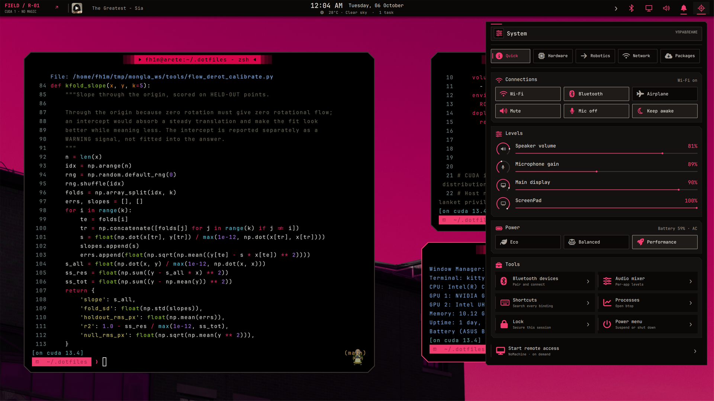
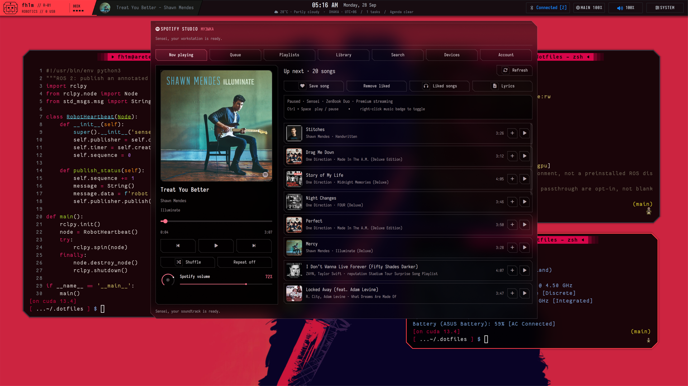
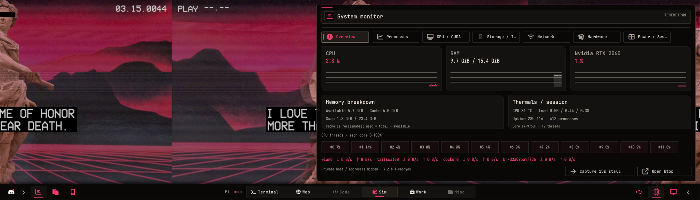
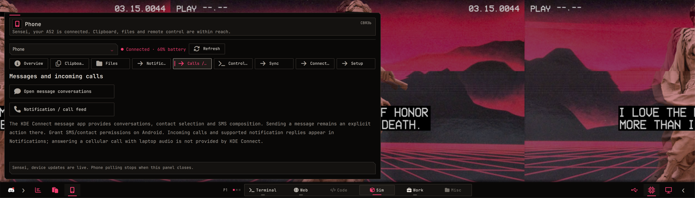
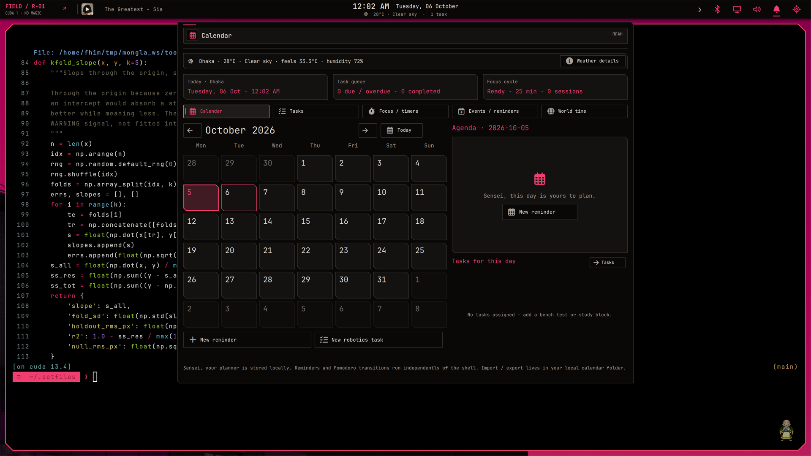
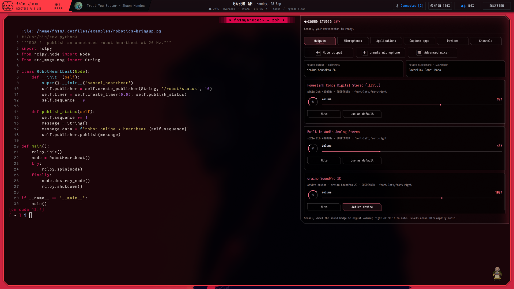
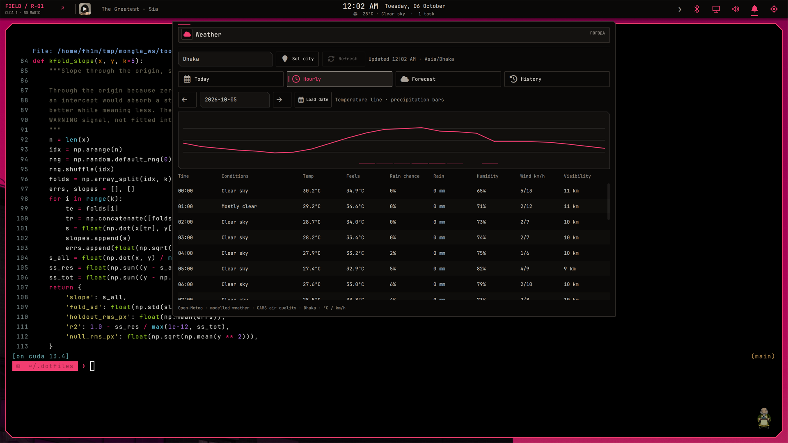
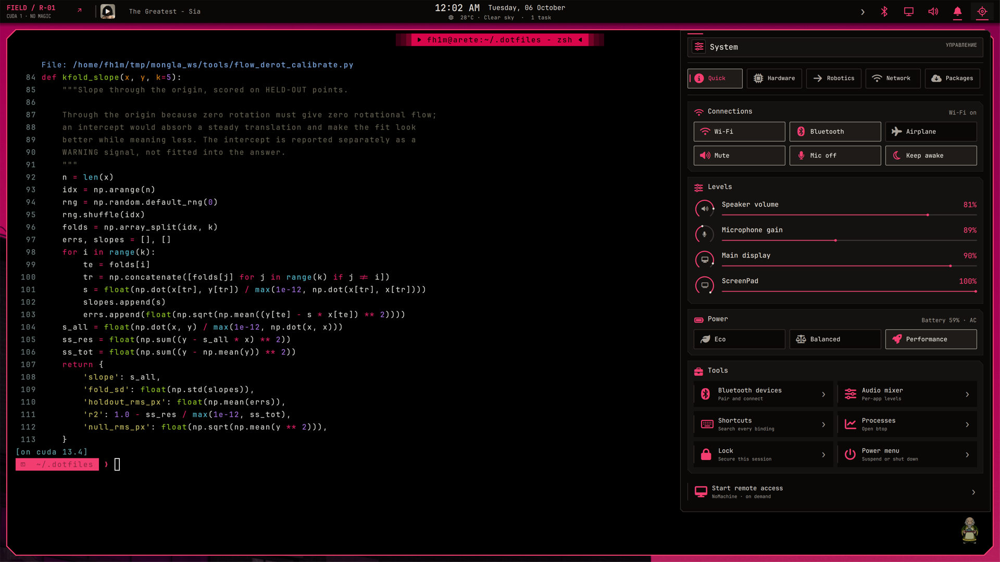

<div align="center">


**Two screens. Two GPUs. One rather opinionated workbench.**

[](docs/installation.md) [](home/.config/quickshell/wrayth) [](docs/hardware-and-boot.md) [](docs/keybindings.md)

[](docs/gpu-and-chrome.md) [](docs/robotics.md) [](docs/phone.md) [](LICENSE)

| Start here | Make it yours | Keep it running |
|:---:|:---:|:---:|
| [Install](docs/installation.md) · [Gallery](docs/gallery.md) · [Keys](docs/keybindings.md) | [Design](docs/design-story.md) · [GPU + Chrome](docs/gpu-and-chrome.md) · [Robotics](docs/robotics.md) | [Hardware](docs/hardware-and-boot.md) · [Performance](docs/performance.md) · [Recovery](docs/operations.md) |
| [Validation](docs/validation.md) · [Workstation patterns](docs/workstation-patterns.md) | [Audio](docs/audio-and-spotify.md) · [Phone](docs/phone.md) | [Version baseline](docs/tested-versions.txt) |


<sub>Real desktop · real windows · real widgets · [watch the smoother MP4](docs/assets/flight-deck.mp4)</sub>

</div>

## The machine, before the windows

<p align="center"><sub>MAIN // 3840 × 2160</sub><br><br><sub>↓ ScreenPad lives directly underneath ↓</sub><br><br><sub>SCREENPAD // 3840 × 1100</sub></p>

**ASUS ZenBook Pro Duo UX581GV.** The big panel is the canvas; the ScreenPad is the instrument cluster. Intel drives both internal displays. The RTX 2060 handles selected graphics and CUDA work. [The actual wiring and GPU limits →](docs/gpu-and-chrome.md)

## A little controlled chaos


*ROS heartbeat. CUDA container. A terminal telling the truth. All three are real Kitty windows.*

<table><tr><td width="50%"><br><sub>SYSTEM // controls where the hand expects them</sub></td><td width="50%"><br><sub>SPOTIFY // album art belongs on the desk</sub></td></tr></table>

The main bar carries identity, music, time, sound and controls. The lower bar carries **Terminal · Web · Code · Sim · Work · Misc**, clipboard, diagnostics, phone, GPU and USB. [See every panel →](docs/gallery.md)

## The second screen has a job

<p align="center"><br><sub>MONITOR → USB · <a href="docs/assets/screenpad-tools.mp4">MP4</a></sub></p>

<table><tr><td></td><td></td><td></td></tr><tr><td><b>Monitor</b><br>Threads, memory, processes, disks, network.</td><td><b>USB</b><br>Ports, permissions, processes, history.</td><td><b>Phone</b><br>KDE Connect, Tailscale, Termux, files.</td></tr></table>

*A meter should answer “why?” before it makes a pretty graph.* When it doesn't, Monitor's **Capture 15s stall** keeps the evidence. [Performance notes →](docs/performance.md)

## Panels with purpose

<table><tr><td><b>Music</b><br>Queue, library, devices, lyrics.</td><td><b>Robotics</b><br>Containers, images, tmux, ARM, CUDA.</td></tr><tr><td><b>Time</b><br>Calendar, tasks, reminders, Pomodoro.</td><td><b>Sound</b><br>Devices, profiles, per-app levels.</td></tr><tr><td><b>Weather</b><br>Now, next, and what came before.</td><td><b>System</b><br>Hardware, network, packages, power.</td></tr></table>

**Music stays local and responsive.** Native transport talks to a patched spotify-player/librespot daemon; catalogue requests take another path. `Ctrl+Space` pauses; `Ctrl+←/→` skips; `Ctrl+↑/↓` adjusts volume. [Audio architecture →](docs/audio-and-spotify.md)

**The lab is one click away.** Docker and Compose, ARM64 containers through QEMU, NVIDIA CDI, serial devices and tmux launches. Tasks also records experiments and reopens a project's tmux session. ARM emulation still runs on the CPU. [Lab manual →](docs/robotics.md)

## Small tricks, large payoff

| Gesture | Result |
|---|---|
| `Super+A` | The spatial workspace overview. |
| `Alt+Tab` / `Super+Tab` | Windows / workspaces, with live previews. |
| `Alt+grave` | Other windows of this app. |
| App shortcut | Focus its existing window, even across workspaces; add Shift for a new one. |
| Badge: left / right click | Operator identity / latest XKCD. |
| Clock: left / right click | Time manager / weather. |
| Training mode | Move managed graphics launches to Intel; leave the RTX to CUDA. |

The launcher keeps native app icons. Search finds open windows **and** installed apps. The clipboard remembers text, screenshots and copied file paths locally, with image previews; its contents never enter this repo.

## Under the shell

- **One animation owner per surface.** Widgets enter in QML; Hyprland does not animate them again.
- **Two GPU paths, deliberate jobs.** Intel composes the dual displays and decodes supported video; NVIDIA renders selected apps and trains models.
- **AV1 is the stubborn bit.** Neither GPU in this laptop has an AV1 hardware decoder. [Measurements →](docs/gpu-and-chrome.md)
- **The phone has a long leash.** Tailscale connects it over mobile data; KDE Connect and Termux provide different levels of control. [Phone guide →](docs/phone.md)
- **A quiet panel does quiet work.** Visible diagnostics sample when needed; music and connection state prefer events. [Idle-work audit →](docs/performance.md)
- **The original spark is [Wrayth by bowenbride](https://github.com/bowenbride/wrayth).** Its shell and cut-corner language grew into this two-screen workstation. [Credits and licenses →](THIRD_PARTY.md)

## Bring your own workbench

```sh
git clone https://github.com/fh1m/.dotfiles.git ~/.dotfiles
cd ~/.dotfiles
python3 scripts/install.py                 # preview
python3 scripts/install.py --apply         # backed-up user files
bash scripts/build-native.sh
python3 scripts/doctor.py
```

Read the [installation guide](docs/installation.md) first. The dual-display preset is **UX581GV-specific**; the generic install does not impose its monitor geometry. Spotify login, driver setup and privileged `system/` examples need separate attention. Your browser profiles, credentials, pairing identities and clipboard history stay yours.
