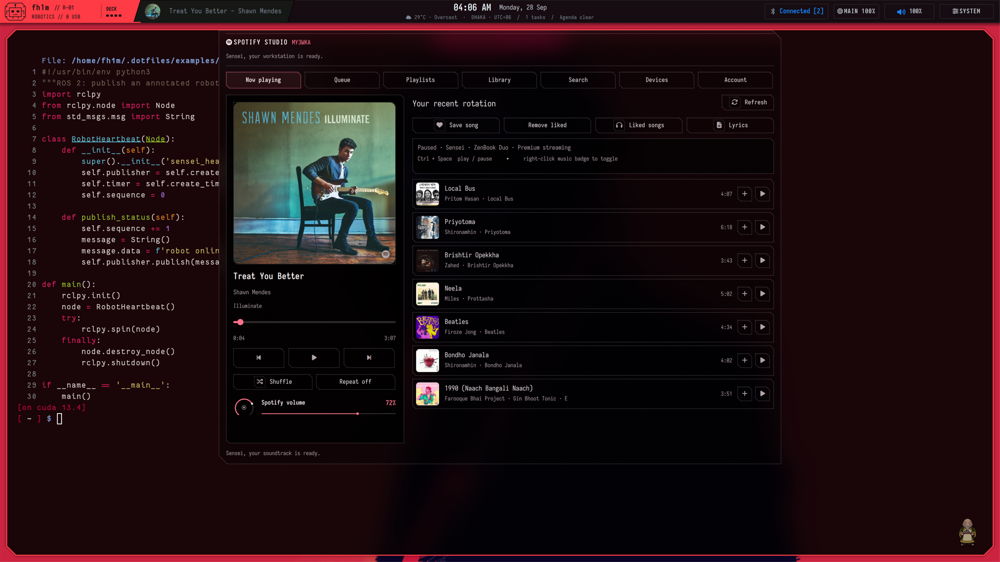
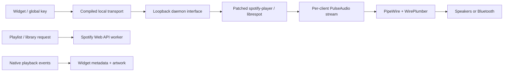

# Music, transport and Bluetooth

[← Workstation](../README.md)



## The path



The Web API is for catalogue/account work, not the fast local transport path. Independent workers prevent playlist fetching from blocking play/pause. Native events carry track, position, state and device ownership; stale remote snapshots cannot casually overwrite them. Artwork replacement does not blank the old cover while downloading.

## Build and authenticate

The repository retains the modified `spotify-player` 0.25.1 source, lockfile and MIT license. Build it with `scripts/build-spotify.sh`, then build the C bridge. Do not substitute the distribution binary and expect the private patches to exist.

Configure `~/.config/spotify-player/app.toml` with **your own Spotify client ID** and an allowed loopback redirect. The published value is a placeholder. Spotify account, API eligibility/scopes and Premium playback restrictions apply. Consult [spotify-player](https://github.com/aome510/spotify-player) and [Spotify’s current migration guide](https://developer.spotify.com/documentation/web-api/tutorials/february-2026-migration-guide) when configuring a new account.

```sh
sensei-spotify-login
systemctl --user enable --now sensei-spotify.service
journalctl --user -u sensei-spotify.service -f
```

Tokens stay in private local cache directories and are not committed. Do not put a client secret into a public desktop config. The local UDP/transport path is a loopback interface, not a service to expose over the network.

## What changed

The player avoids duplicate daemon/TUI catalogue work, preserves skip intent, restores local queue context, and preloads one next track earlier. The audio cache is bounded at 256 MiB. Local ownership is deliberately selected; automatic reconnect does not keep stealing Spotify Connect playback from another chosen device.

Playlist rows distinguish **browse the collection** from **play it**. API parsing accepts modern `/items` wrappers and older `track` forms; pagination is context-bound; repeated URIs are removed; inherited search filters are cleared. A late library request cannot empty or replace a newer playlist page.

Bridge status calls measured roughly 2–4 ms in short local samples. Cold audio retrieval had previously taken 2.7–3.4 seconds after the command arrived. Preloading helps known next tracks; uncached/unavailable songs still depend on network/Spotify responses. This is not a claim that every remote track can start instantly.

## Sound controls

The Sound panel reports active output/source, devices/profiles and per-application streams. Volume acknowledgement is separate from delayed catalogue requests, so a slider does not snap back to an old server value. Detailed subscriptions run while the panel is open; native PipeWire controls provide immediate feedback.

The experiment with an aggressive Spotify client latency override made listening less robust. It was removed. Normal client buffering (~145 ms observed in one sample) and normal CPU priority provide scheduling headroom without slowing UI command dispatch. Global PipeWire quantum/sample rate were not broadly changed.

## Bluetooth investigation

The reference headset exposed SBC, SBC-XQ and hands-free CVSD, but not AAC/aptX/LDAC. A setting cannot invent a codec the devices do not negotiate. Regular SBC at tested bitpool 53 was more stable than XQ in the captured comparison.

Moving Wi-Fi to 5 GHz reduced 2.4 GHz coexistence pressure. Discovery stops when the widget closes and expires after 20 seconds; paired devices appear from cached state immediately. Automatic hands-free switching is disabled for the music policy so microphone use does not unexpectedly replace stereo playback. Hands-free remains manually selectable.

`pw-top` showed no graph underruns even when listening still jittered. HCI timing revealed a more specific issue: short stalls caused an outgoing L2CAP socket to hit queue pressure, and PipeWire’s sink could drop packets. A headset-only `SO_SNDBUF` interceptor increased queue headroom. A larger-buffer trace recorded 3,375 packets over 44.99 seconds with zero sequence gaps; SBC-XQ comparison recorded 20 gaps in 45 seconds. Those samples support the change, not a promise of zero radio interruptions forever.

## Optional socket workaround on a new machine

Build `src/bluetooth/a2dp-buffer.c`. The published code requires `SENSEI_A2DP_ADDRESS`; without it, it passes socket operations through unchanged. Use the example WirePlumber drop-in under `system/bluetooth`, substitute your actual headset address, and activate it only after reproducing a relevant issue. It affects outgoing Bluetooth A2DP L2CAP traffic for that peer, not TCP, ALSA or every headset.

```sh
systemctl --user daemon-reload
systemctl --user restart wireplumber
```

A restart can invalidate an existing Spotify audio stream; recover the player after maintenance. Roll back by removing only that drop-in, daemon-reloading and restarting WirePlumber. The workaround trades additional queue latency during radio stalls for fewer packet losses. No root cause is claimed for every possible Spotify network/audio interruption.

## Useful checks

```sh
wpctl status
pactl list sink-inputs
bluetoothctl info HEADSET_ADDRESS
pw-top
# Packet tracing needs appropriate privilege and contains device metadata:
sudo btmon
```

Do not publish raw traces or pairing state. The Bluetooth panel provides connection counts, device trust/block/nickname, audio state, bounded discovery and diagnostic tools. Only advertised battery/codec/radio data is displayed; unavailable fields remain labelled.

References: [WirePlumber Bluetooth configuration](https://pipewire.pages.freedesktop.org/wireplumber/daemon/configuration/bluetooth.html), [PipeWire media sink](https://github.com/PipeWire/pipewire/blob/master/spa/plugins/bluez5/media-sink.c), [Intel Wi-Fi driver documentation](https://wireless.docs.kernel.org/en/latest/en/users/drivers/iwlwifi.html).
