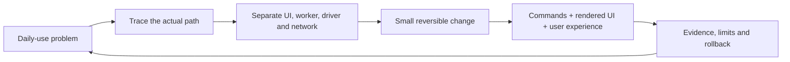

# From GNOME migration to robotics workstation

[← Workstation](../README.md)

## The brief

fh1m’s starting point was a comfortable GNOME desktop on a dual-display ZenBook. Text sizes already felt right. The purpose of changing the desktop was not to lose that comfort; it was to make the machine more enjoyable and more useful for robotics work.

The first problem was fundamental: entering Hyprland produced a black screen. A TTY and the still-installed GNOME session provided a way back. Once the session worked, the ScreenPad showed duplicated/incorrect content. Explicit output modes, scale and placement replaced assumptions inherited from another setup.

The desktop then had to acquire the habits of its owner: named workspaces, manual idle control, natural scroll, music, clipboard, screenshots, model-training awareness, phone access, and controls for the hardware actually present.

## What Wrayth contributed

[Wrayth](https://github.com/bowenbride/wrayth) supplied the shell foundation: Quickshell components, deck, notification daemon, lockscreen, launchers, profiles, helpers and a distinctive cut-corner visual vocabulary. Starting there avoided inventing every surface from scratch. The retained design document explains its original direction; this repository documents the adaptation rather than overwriting its authorship.

## Decisions that made it personal

| Need | Decision | Why it matters |
|---|---|---|
| Main panel over ScreenPad | Separate bars, with detailed tools on the appropriate display | No duplicated launcher or crowded ScreenPad |
| Comfortable existing text | Preserve sizes and scale, improve rendering rather than shrinking everything | A daily driver is read for hours |
| Robotics context | GPU/CUDA state, USB inspection, Docker/tmux and phone commands | Hardware and environments become inspectable |
| Lots of browser tabs | Hardware rendering/decode where supported, Memory Saver, preserve profiles | Speed without deleting work |
| Music always available | Native background client, event-driven transport, bounded cache | Catalogue loading should not block a pause click |
| A personal operator identity | Sensei greetings and useful badge interactions | Personality stays in the interface, not in random notifications |
| A coherent shape language | Chamfered panels, fields and buttons | Corners echo the window styling |
| OLED/glass preference | Black translucent widgets, warm text and coral accents from the wallpaper | Glass can be visible without sacrificing labels |

## The palette evolved

Early versions used red/blue more broadly and inherited text treatments from the source shell. Bangla accents were tried, then replaced with Russian labels at the owner’s request. Cyan was removed in favour of blue tones. Later, widgets became OLED black glass with quieter, wallpaper-derived foreground accents. Bars and widget surfaces remain distinct: red/blue carries identity and navigation; glass lets the wallpaper participate beneath detailed controls.

Rounded button shapes and an extra dark backing rectangle made cut-corner panels look inconsistent. The back layer was removed. UI controls use readable labels, restrained hover feedback, explicit selected states and sensible padding. Rotary controls and thin rails make adjustments easier to distinguish from tabs and actions.

## Motion is a technical design decision

A fade applied to a whole application can look like a flash when focus or workspace changes. Those broad fades were removed; geometry transitions carry movement instead. Entry/exit scales are restrained. Workspace slides are kept independent of popup animations.

Widgets have one animation owner: QML. Hyprland layer animation is disabled for those namespaces. Surface reconfiguration is avoided during reveals; the layout must settle first. Focus/input is released at closing time, rather than waiting for a decorative exit to end. The switcher defers final application activation until its overlay has unmapped.

Those fixes came from reported discomfort, not from a claim that every animation must run at a specific benchmarked frame rate. The dual high-resolution Intel compositor remains a meaningful load. Real listening and interaction feedback remain part of testing.

## The engineering loop

Examples: a Spotify skip delay was partly audio loading, not only UI transport; a Bluetooth graph with no underruns still concealed dropped radio packets; an enabled GPU label did not prove decoded frames; an old NVIDIA CDI library path prevented container startup despite a healthy GPU.

## What this is not trying to pretend

The system cannot manufacture a display MUX, add AV1 decoding to unsupported silicon, guarantee internet/radio continuity, or offload arbitrary browser JavaScript into VRAM. It can assign suitable workloads, reduce unnecessary polling, preserve data and make failures easier to diagnose.

Historical notes are retained because failed paths are useful knowledge. Newer postboot results supersede earlier hypotheses. The repository’s current installation defaults remain conservative for a new machine; the reference laptop’s tuned path is described separately.
