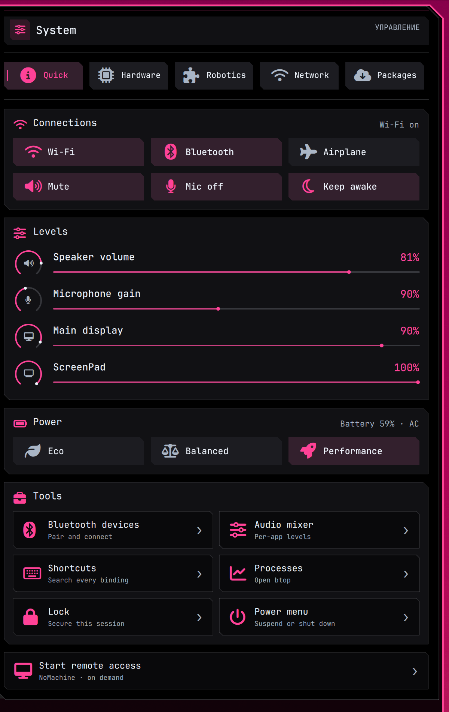
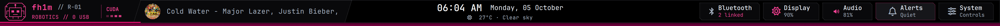
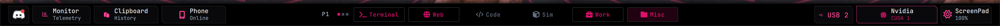

# Sensei interface

The wallpaper provides the color. The shell provides the instrument panel.

JetBrains Mono keeps labels, glyphs and terminal metrics coherent. Icons lead each action; smaller labels say what it does.

## Color roles

`sensei-palette` samples the main display image with Matugen. It keeps the image's dominant hue as the only chromatic UI accent; on the current hot-pink skyline, that becomes rose `#ff4297`. The source hue `#df106d` stays in small identity marks. No cyan, yellow or purple companion is invented. Backgrounds remain OLED `#000000` regardless of wallpaper.

| Role | Current value | Use |
| --- | --- | --- |
| Ground | `#000000` | Widget canvas, bars, GTK/Qt windows, terminals |
| Surface | `#111114` | Quiet controls and cards |
| Raised | `#1c1c21` | Hover and active subpanels |
| Text | `#edf3fb` | Titles and essential data |
| Muted | `#a9b5c5` | Secondary readings |
| Accent | `#ff4297` | Selection, focus, active work and small indicators |
| Outline | `#424957` | Structural edges; never a grid around every action |

The visual weight order is **one emphasized action → selected state → ordinary action → passive reading**. Multiple toggles on one page do not all become large saturated tiles. A selected control gets a narrow rose marker and a small tonal lift; danger uses its own red role. Icons and words agree about state.

## Type and geometry

JetBrainsMono Nerd Font Propo is for headings, buttons, descriptions and form labels. JetBrainsMono Nerd Font Mono is for time, percentages, paths, telemetry, terminal and code. UI labels use sentence case and no added tracking. Russian microcopy is an accent, never the only label. Controls use a 4–5 px cut corner; panels use a 16 px cut. Bar actions use near-black cards that blend with the rail; the workspace names retain their lighter treatment. The music card keeps its slanted edge, and the clock sits directly on the black rail. Native Hyprland group bars use quiet black tabs, titles and a small active marker. A button has a minimum 34 px visual height in bars; widgets use larger targets where the layout permits.

## Motion and responsiveness

Press feedback begins immediately (60–70 ms); hover/selection settles within 130–150 ms. Dropdown geometry stays fixed during reveal; content fades and moves inside the surface. Repainting a Qt `Shape` path or running JavaScript on every animation frame is avoided. Heavy widget content is loaded on demand, with a visible loading state. Project discovery runs only when opened; wallpaper color extraction runs only when the main image changes.

## Surface map

`Theme.qml` owns the live tokens. `WidgetSection.qml`, `ControlTile.qml`, `DropdownFrame.qml` and `BarSurface.qml` own the recurring shapes and states. `sensei-palette` writes the terminal, tmux, GTK, Qt and shell-prompt counterparts. `wrayth-profile` re-applies the wallpaper palette after its legacy profile sync, so startup cannot put the old colors back.

Sources and the 40-query research log: [UI research](research/ui-design.md).
