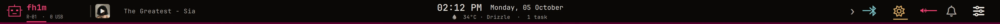
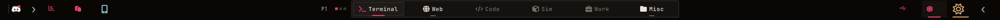
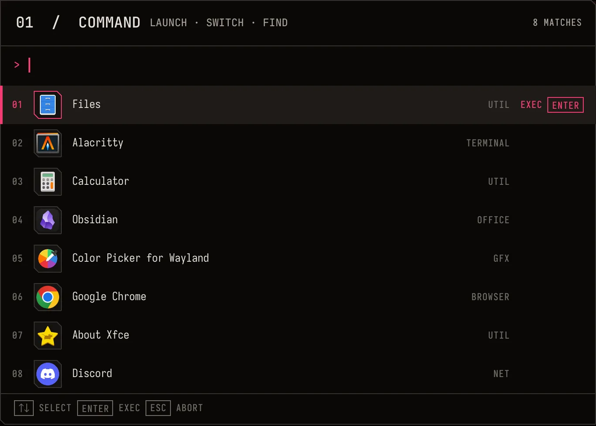

# Signal Ledger

An instrument panel for a robotics workstation. The desktop is calm until a real state changes.

## Research distilled

- [Caelestia Shell](https://github.com/caelestia-dots/shell): one moving selection surface explains navigation. The workspace rail uses a single traveling carriage; it does not inherit Caelestia's pill shapes.
- [end-4](https://github.com/end-4/dots-hyprland): overview and search should serve actual daily tasks. Command keeps native app icons and keyboard-first fuzzy results.
- [DankMaterialShell](https://github.com/AvengeMedia/DankMaterialShell): semantic tokens and explicit state transitions make a shell maintainable. No Material cards or Control Center layout were carried over.
- [Noctalia](https://github.com/noctalia-dev/noctalia-shell): quiet information density. Only connected, active, or exceptional states receive color.
- [Ritual](https://github.com/roosta/dotfiles): composable per-monitor shell surfaces. The main display and ScreenPad have different jobs.
- [OP-1](https://teenage.engineering/products/op-1/original/overview), [Playdate](https://help.play.date/developer/designing-for-playdate/), and [NASA cockpit displays](https://www.nasa.gov/human-systems-integration-division/cockpit-display-design-intelligent-spacecraft-interface-systems/): direct controls, playful restraint, clear off-nominal state.

Three routes were considered: **Signal Ledger** (warm instrument rail), **Field Manual** (paper-like technical folios), and **Night Scope** (scope traces and plots). Field Manual would read poorly over real work windows; Night Scope would invite decorative telemetry and continuous animation. Signal Ledger keeps the useful typographic hierarchy and real-state motion without either problem.

## Tokens

| Role | Value | Use |
| --- | --- | --- |
| Ink | `#090807` | opaque ground and terminal |
| Paper | `#e8e2da` | primary text |
| Muted paper | `#a9a29a` | explanations and inactive values |
| Signal | `#f23d70` | identity, selected work, progress |
| Cyan | `#76bcc0` | connected external paths only |
| Amber | `#d6a65e` | caution only |
| Surface 1 / 2 | `#141210` / `#1e1b18` | section and raised action |
| Rule | `#39342f` | one-pixel structure |

JetBrainsMono Nerd Font Propo carries UI labels; Iosevka Nerd Font Mono carries values, terminal text, and telemetry. The spacing step is 4 px; ordinary cuts are 2–5 px. Borders are one pixel. Actions acknowledge in 100 ms, selections travel in 180 ms, and panels reveal in 210 ms. Motion is reserved for selection, loading, opening, and live playback. No idle dashboard animation, sampled blur, or decorative scanlines.

The token source is `home/.config/quickshell/wrayth/config/Theme.qml` and the shell/terminal palette publisher is `home/.local/bin/sensei-palette`. Wallpaper changes no longer rotate the meaning of UI colors or run Matugen. Other widgets inherit the same tokens through the shared frame and control components.

## Interaction rules

- The main rail carries identity, music, time, connectivity, and system controls. The ScreenPad rail carries tools, workspace navigation, and machine state.
- Both rails fold their readout text behind a small arrow. The compact view uses icons and real state marks; the expanded view exposes names and values without opening a second panel. The bar ground itself has no outline.
- Workspace occupancy brightens text. The selected workspace moves one dark carriage and a short signal rule. No full-cell alert fill.
- Command gives the current result one signal rule and keeps real application icons. The media panel uses a continuous tab rail and leaves art at useful size.
- Notifications read as dispatch slips: sender, message, action, timeout. Critical alerts retain the signal color and do not auto-dismiss.
- Grouped windows use one black title strip, native click-and-drag tabs, app icons, and a signal underline on the active tab. The outer cuts follow the window silhouette.
- Tmux uses text-only label/value blocks. Window numbers and session labels stay dark with signal text; their values and active window titles invert to signal fill and dark text. Pane/window close keys request confirmation.
- Balanced is the AC starting profile. The fan stays in firmware auto even when CPU Performance is selected. Full fan boost is a separate manual override.

## Prototype critique

The initial captured media page was too much like a generic card dashboard. Tabs were changed to a continuous rail, translucent card fills became opaque, and scanlines were removed from shared surfaces. The first ScreenPad capture repeated its wallpaper because it was in tile mode; crop mode gives the lower display one stable backdrop. The command result list retains generous horizontal blank space because name and category are separated for fast scanning; it is data space rather than a decorative card.

The included images are UI-only crops; they omit terminal contents and private windows.

## Bar control directions

Three approaches were compared against the same real controls:

| Direction | At rest | When expanded | Trade-off |
| --- | --- | --- | --- |
| **Folded instrument rail** (live) | Large icons, tiny state marks | Inline names and values | Keeps controls one click away without permanent text noise |
| Command spine | One system mark plus urgent alerts | One searchable control drawer | Calmest bar, but adds a click for common audio and display changes |
| Distributed dials | Small audio/display meters beside the clock | Dedicated detail panels | Readings are always visible, but the clock loses its quiet center |

The current prototype uses the first direction. Its arrows reveal information, not new duplicate controls. Cyan means a connected external device; amber is the screen brightness meter; signal pink marks active audio, unread alerts, and selected work.
