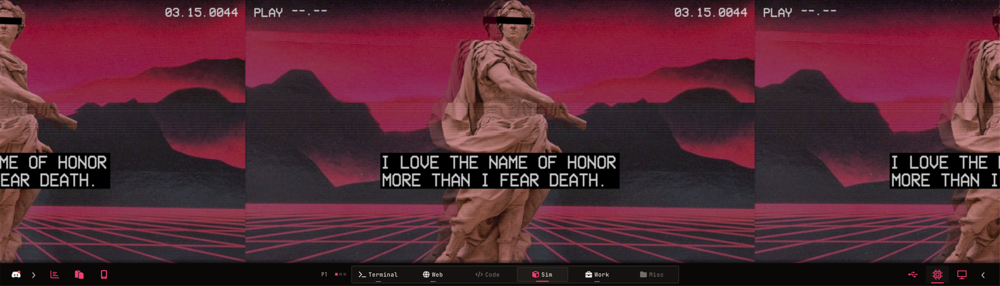
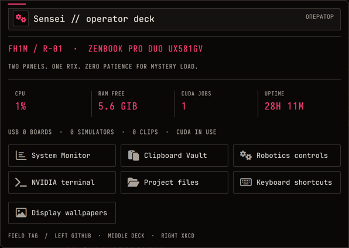
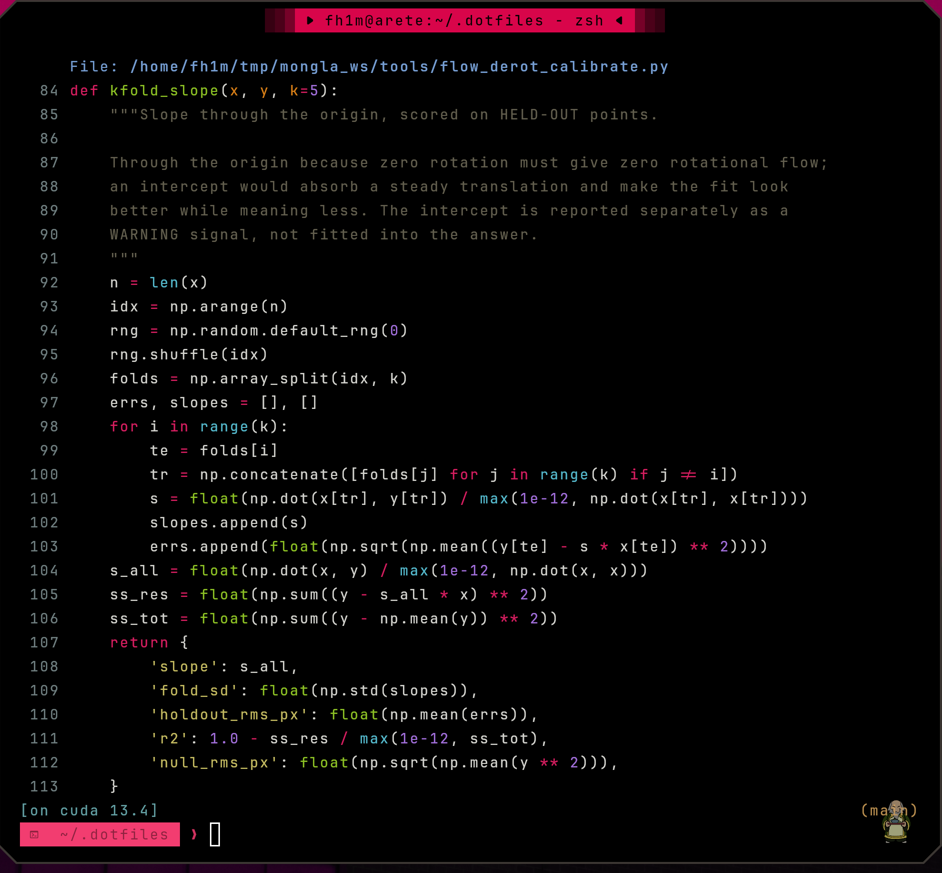
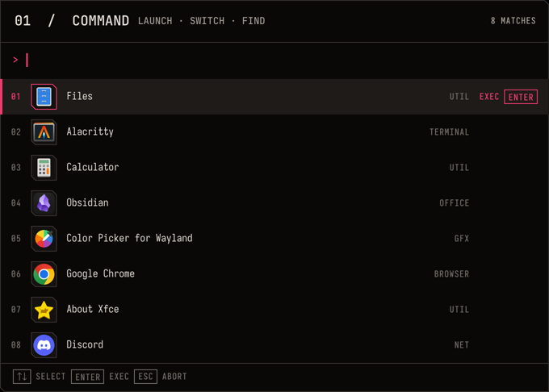
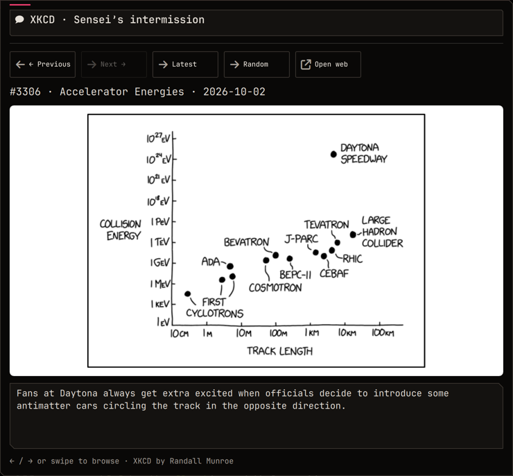

# Actual desktop gallery

[← Workstation](../README.md)

These are real screenshots of fh1m’s desktop. A temporary privacy mode suppresses personal notifications and private window previews. The code window opens [Mongla’s public optical-flow calibration](https://github.com/fh1m/mongla_ws/blob/main/tools/flow_derot_calibrate.py); the other shows this repo’s CUDA Compose recipe. Neither screenshot claims a vehicle or container was running. The system numbers are live samples.

## Watch the workbench work

[Main display MP4](assets/flight-deck.mp4) · [Full-size floating workstation](assets/floating-workstation.png)

[Robotics MP4](assets/robotics-lab.mp4) · [Lab guide](robotics.md)

[Tmux MP4](assets/tmux-field-lab.mp4) · [Full-size still](assets/tmux-field-lab.png) · [Terminal guide](terminal.md)

[ScreenPad MP4](assets/screenpad-tools.mp4)

| Surface | Purpose |
|---|---|
| Empty main + ScreenPad | The actual stacked UX581GV desktop before showcase windows open |
| Main workspace | Comfortable code reading on the main panel |
| ScreenPad | Navigation and practical tools on the second display |
| System | Quick controls, hardware, robotics, networking and packages |
| Monitor | Live resources, processes and hardware views |
| Spotify | Native player, artwork, transport, queue/library/devices |
| Sound | Per-device and per-app routing/volume/profile controls |
| Calendar | Calendar and time-manager entry |
| Docker | ARM and native NVIDIA tooling within the lab |
| Phone | Calls/messages feature entry without publishing personal conversations |
| USB | Current device inventory and diagnostic entry |
| Weather | Forecast view |
| Launcher | Native icons and search |
| Operator | Live CPU, available RAM, CUDA work and lab shortcuts |
| Native tabs | Alacritty and Obsidian with a cut-corner, inset title strip |
| XKCD | Right-click intermission, with keyboard and swipe navigation |

## Main / ScreenPad

*Big canvas above; tiled instrument field below. The repeat is deliberate.*

## System and observability

## Music and sound

## Time, weather and phone

## Robotics and navigation

*The code is a held-out calibration fit from the public AUV stack; the terminal is set smaller so you can read more than twelve lines at once.*

## Intermission

*An engineer may press Right Click to consult a stick figure. This one is [XKCD #3306](https://xkcd.com/3306/) by Randall Munroe ([CC BY-NC 2.5](https://xkcd.com/license.html)).*

The [switcher implementation](../home/.config/quickshell/wrayth/modules/navigation/NavigationOverlay.qml) combines app/window cards with a six-space drag overview. On the reference hybrid-GPU session, `grim` stalled while the live toplevel previews were active, so these two surfaces are deliberately absent from the gallery. They remain available with Alt+Tab and Super+A in the actual session.

## Re-capture on your machine

`scripts/capture-gallery.py` takes the stills. `scripts/capture-showcase.py` records the main/ScreenPad tours. `scripts/capture-workflows.py` records the robotics/tmux tours on an empty workspace with a separate tmux socket. All use the live desktop, restore focus and close only their showcase windows. Review every frame before publishing; new widgets may need additional privacy treatment.
