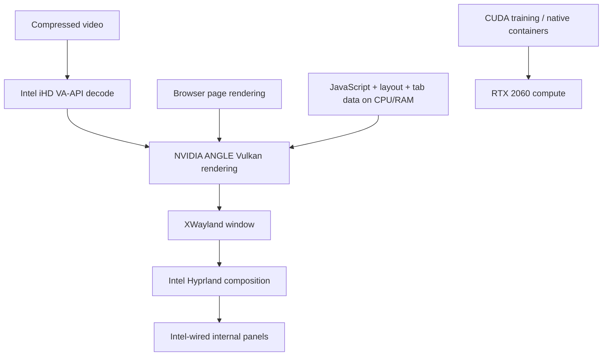

# GPU placement, video decode and Chrome

[← Workstation](../README.md) · [Training workflows](robotics.md)

## First: distinguish four different jobs



This is the **tested Chrome hybrid path**, not a universal map for every app. mpv can use NVIDIA NVDEC directly. Intel-native Chrome is the training-mode alternative. Rendering, decode, scanout and CUDA are separate APIs and workloads. GPU acceleration does not turn a many-tab browser’s heap or website scripts into VRAM work.

## The physical constraint

On UX581GV, both internal panels belong to Intel PCI `0000:00:02.0`; the NVIDIA GPU is PCI `0000:01:00.0`, with its own external HDMI path. No display MUX interface was found. A software environment variable cannot change panel wiring. Moving composition onto NVIDIA would introduce cross-GPU transfers and need a session restart; it was not retained after native-fence crashes.

Use persistent PCI paths, not assumed `renderD128`/`card1` numbering:

```sh
ls -l /dev/dri/by-path/
readlink -f /sys/class/drm/card*-eDP-*/device
readlink -f /sys/class/drm/card*-DP-*/device
nvidia-smi
```

## What failed and what worked

Native NVIDIA Wayland Chrome reproducibly triggered Intel Mesa native-fence / execbuf failures during the investigation. Scoped XWayland avoided that path on this machine. See [NVIDIA issue 1037](https://github.com/NVIDIA/open-gpu-kernel-modules/issues/1037) for related upstream discussion; matching symptoms do not prove every crash has the same cause.

The retained wrapper uses X11/XWayland, NVIDIA ANGLE Vulkan and an explicitly selected Intel video device. NVIDIA environment overrides are **per process**, not exported globally into Hyprland or every GTK/Qt app. No disabled browser sandbox, preload video-driver shim or system libva replacement is part of this path.

The wrapper’s flags are source, not timeless recommendations. Inspect `home/.local/bin/sensei-chrome`; Chromium feature names may change. Keep a normal Intel fallback and re-test after driver/browser updates.

## Evidence from the reference laptop

| Test | Observation |
|---|---|
| Sustained 4K H.264 | VaapiVideoDecoder; platform decoder true; NVIDIA renderer; 613 frames, one initial drop, no additional warm-up drops |
| 4K VP9 / HEVC | Hardware decoder confirmed and playback progressed; initial drops were recorded |
| H.264 CPU comparison | Hardware: 1.55 CPU-seconds / 12.5548 wall seconds; software: 17.31 / 12.7828 |
| Direct NVIDIA mpv | 4K NVDEC playback, zero observed decoder/presentation drops in the test |
| Training transition | Actual Chrome Intel → NVIDIA restored with saved tabs and graceful relaunch |
| Limits | Intel desktop composition still high; no AV1 hardware decoder in either GPU |

The CPU comparison is approximately **91% less normalized CPU work** for that synthetic local test. It is not a promise for encrypted streaming, every codec, every tab or another driver version. Details and superseded observations are in `history/POSTBOOT.md`.

## New-machine validation

The exported config starts on **Intel**, with no claim that the new hardware passed the ZenBook tests. Before enabling the NVIDIA route:

1. Align kernel, NVIDIA kernel module and userspace driver; reboot after replacing an in-use module.
2. Verify both render nodes and the Intel media driver. Check `vainfo` for supported codecs on the Intel node.
3. Use a disposable Chrome profile for experiments. Preserve the real profile and never run two processes against the same profile directory.
4. Inspect `chrome://gpu` and `chrome://media-internals` during an actual supported video. Confirm the renderer, `VaapiVideoDecoder`, platform-decoder state, progressing frames and visible output.
5. Inspect journal/kernel errors and compare a steady CPU sample. An acceleration label alone is insufficient.
6. Only then save the tested choice:

```sh
python3 scripts/configure-gpu.py --confirm-tested \
  --intel-pci 0000:00:02.0 --nvidia-pci 0000:01:00.0
```

That command is an **explicit acknowledgement**, not an automated benchmark. It records the current kernel/driver and chosen PCI paths. A changed kernel/driver causes the exported wrapper to fall back until the path is validated again. The original live laptop uses its historical diagnostic evidence; the repository uses this portable opt-in gate instead.

Close/relaunch Chrome normally to apply the setting. `sensei-chrome restart` uses graceful shutdown and restores the saved session; if Chrome refuses to exit, it stops and asks for normal closure rather than forcing it. The wrapper backs up profile preferences before Memory Saver/preloading tuning; it never removes cookies, history, extensions or passwords.

## Profile and memory choices

Balanced Memory Saver and reduced speculative preloading are used. Localhost, loopback and Colab are protected from discard. These are pragmatic defaults; protect additional long-running web apps explicitly. GPU video decode reduces decode CPU, not all tab RAM. Measure proportional set size (PSS), available RAM and memory pressure rather than adding shared RSS values together.

## Training and rollback

Use Monitor → GPU/CUDA or System → Robotics → Training. Managed graphics launches move to Intel; NVIDIA remains available to CUDA. Already-running unmanaged graphics apps need relaunching. A NVIDIA-wired monitor can keep the GPU active even when no training job is running.

```sh
sensei-chrome mode intel
sensei-chrome restart
sensei-gpu-run intel application
sensei-gpu-run nvidia application
sensei-video video.mp4
```

Never overwrite a live Chrome profile with an older full backup. Restore only the configuration preference you intend to undo, preserving newer browsing databases.

Sources: [Chromium VA-API code](https://chromium.googlesource.com/chromium/src/+/main/media/gpu/vaapi/), [NVIDIA decode matrix](https://developer.nvidia.com/video-encode-decode-support-matrix), [mpv manual](https://mpv.io/manual/master/), [NVIDIA runtime power management](https://download.nvidia.com/XFree86/Linux-x86_64/615.71.09/README/dynamicpowermanagement.html).

## October 4 driver recheck

With kernel `7.2.8-1-cachyos` and NVIDIA `615.71.09`, a disposable real-window Chrome profile played local 1080p H.264 twice through the **hybrid route**: NVIDIA Vulkan rendering plus Intel VA-API decode (`VaapiVideoDecoder`, `kIsPlatformVideoDecoder=true`), with no observed playback errors. The live Chrome session was restarted into the validated NVIDIA mode after a settings snapshot; `sensei-chrome status` reported actual NVIDIA rendering. Direct NVIDIA VA-API through `libva-nvidia-driver 0.0.18` failed in most scratch Chrome tests with decode errors/GPU-process restarts, so it was not promoted to the daily profile. The RTX 2060 can decode H.264/HEVC/VP9, but not AV1; Intel still owns both built-in panels. [Chromium VA-API guide](https://chromium.googlesource.com/chromium/src/+/main/docs/gpu/vaapi.md) · [NVIDIA VA-API driver releases](https://github.com/elFarto/nvidia-vaapi-driver/releases) · [NVIDIA codec matrix](https://developer.nvidia.com/video-encode-decode-support-matrix).

### Sharp NVIDIA Chrome on the two 2× panels

In this Hyprland session, XWayland initially rendered Chrome at half resolution and Hyprland enlarged it. The result was visibly pixelated text. A disposable browser window established three states at the same screen position: default XWayland text was blurry; adding Chrome scale factor 2 alone made it twice as large and still blurry; `xwayland.force_zero_scaling=true` **paired** with `--force-device-scale-factor=2` made the glyph edges crisp at the original apparent size. The live NVIDIA browser was restarted on that pair; `sensei-chrome status` again reported actual NVIDIA rendering. The wrapper now restores the last-used Chrome profile directly to avoid the profile picker after a managed restart. The user profile itself was not edited for font settings.

This pair assumes the UX581GV's current **2×** displays. If you change panel scale, test the matching browser factor before reusing it; a lone Chrome scale flag is not the fix. XWayland's option affects other X11 windows too. [Hyprland XWayland HiDPI](https://wiki.hypr.land/configuring/extra/xwayland/) · [Chromium scale-factor switch](https://chromium.googlesource.com/chromium/src/+/HEAD/ui/display/display_switches.cc).
