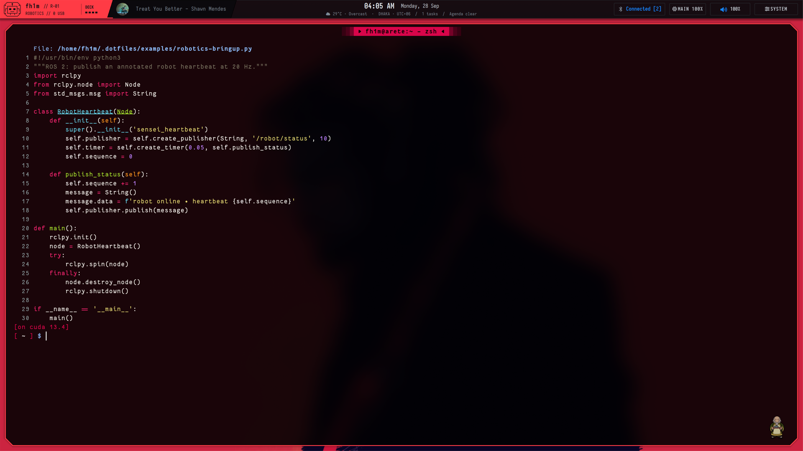

# A new Arch laptop → Sensei workstation

[← Workstation](../README.md) · [Hardware](hardware-and-boot.md) · [Recovery](operations.md)



## 1. Establish the operating system first

Install Arch using the [official installation guide](https://wiki.archlinux.org/title/Installation_guide). Choose your partitioning, encryption, filesystem, kernels and bootloader for that machine. This repository does not partition disks or automate firmware changes. CachyOS is the reference distribution, but the shell does not require CachyOS-specific optimization packages.

Have a normal non-root account, sudo, functioning networking, a terminal fallback and a bootable fallback kernel. Before changing sessions, ensure you can log in on a TTY. Keep your existing desktop until Hyprland is verified. The reference migration kept GNOME available for recovery.

The shell expects **Hyprland 0.56+ Lua configuration**, not an older `.conf` dispatcher syntax, and Quickshell 0.3-era APIs. Review the current installed versions against `tested-versions.txt` rather than copying version numbers into a package downgrade.

## 2. Install packages

Review `packages/core.txt`; package availability may change. On the current Arch repositories the Nerd Font packages are `ttf-zed-mono-nerd` and `ttf-iosevka-nerd`. Use a full system update rather than a partial Arch upgrade.

```sh
sudo pacman -Syu
mapfile -t core < <(sed '/^[[:space:]]*#/d; /^[[:space:]]*$/d' packages/core.txt)
sudo pacman -S --needed "${core[@]}"
# Optional: containers and phone tools
mapfile -t extra < <(sed '/^[[:space:]]*#/d; /^[[:space:]]*$/d' packages/robotics-phone.txt)
sudo pacman -S --needed "${extra[@]}"
```

Those examples use bash. Review `packages/optional.txt` for Google Chrome, system76-power, asusctl and hardware extras. Use **paru** for AUR packages after reading their PKGBUILDs. The installed GPU kernel module must match your kernel and hardware generation; the generic package list deliberately does not choose it for you.

Enable the system services you actually use: NetworkManager, Bluetooth, and optionally Docker and tailscaled. Use one power-profile backend; the reference controls use system76-power. Do not run competing power-policy daemons. Establish PipeWire, pipewire-pulse and WirePlumber as the user audio stack; do not run two competing PulseAudio servers.

## 3. Render the dotfiles with backups

```sh
python3 scripts/install.py
python3 scripts/install.py --apply
# Only for the matching dual-display ASUS laptop:
python3 scripts/install.py --hardware zenbook --apply
```

The default is a dry run. Apply writes user files under your home directory and backs up replaced files to `~/.local/state/dotfiles-backups/<timestamp>/`. Existing symlinks are preserved in the backup before replacement. Re-running an unchanged install is idempotent. It never wipes your entire `.config` or `.local` directory.

`@HOME@` placeholders are rendered to your home path. Upstream Wrayth helpers are linked to the retained shell sources; Chakra Petch and generated wallpapers are installed. `--hardware generic` removes the UX581 output rules and puts the bottom bar on the primary screen if there is no secondary screen. Use `hyprctl monitors -j` and edit `custom-setup.lua` for your actual modes, positions and scales before relying on the session.

**Do not run Wrayth’s upstream installer after applying this snapshot unless intentionally resetting it.** Its original installer and README are retained as reference. The root-level installer here is the entry point for this adaptation.

The installer does not alter `/etc`, enable startup services, compile Spotify, authenticate accounts, or change your shell login files. Add `~/.local/bin` to your login/session PATH if absent. Keep current browser and keyring data; neither is copied by this repository.

## 4. Build the native components

```sh
bash scripts/build-native.sh
bash scripts/build-spotify.sh
```

The C bridge needs a C compiler, json-c, OpenSSL and BlueZ development headers. Both native sources compile on the reference machine. The Bluetooth shared object is **inactive** until you explicitly add its drop-in and headset address.

Spotify is a patched source build, not a binary copied from the original machine. The Rust build uses the retained lockfile, daemon, PulseAudio and media-control features. Two build jobs are the default to limit memory pressure. A fresh release build can take time and disk space; it is not done every login. Read [Spotify setup](audio-and-spotify.md), configure your own Spotify OAuth client ID/redirect and authenticate before enabling its service.

## 5. Set up session integration

The Lua session starts the Wrayth wrapper and Hypridle. GNOME Keyring, the KDE polkit agent, environment export and clipboard service are integrated in the personal setup. Review `/etc/pam.d` and your display manager’s session files for your distribution; do not copy PAM files blindly.

Use `gnome-keyring`/libsecret for Chrome’s existing credentials. A password-protected login keyring can normally unlock through PAM on password login. Automatic login cannot supply a password it never received. The original workstation deliberately removed its keyring password; that leaves secrets unencrypted on disk and is **not** an installer default. Do not migrate that security choice accidentally.

Quickshell also provides a lockscreen. Review upstream Wrayth’s PAM setup and the included lock assistant. A compositor lock failure is more important than decorative success: test lock/unlock while you have a recovery path.

```sh
systemctl --user daemon-reload
systemctl --user enable --now sensei-calendar.service sensei-usb-history.service
# Run after starting the Wayland session and exporting its environment:
systemctl --user enable --now clipboard-vault.service
# Only after the private Spotify build and authentication:
systemctl --user enable --now sensei-spotify.service
```

The idle policy does not dim or lock automatically. It watches battery-only suspend after ten minutes. Manual lock remains available. Optional suspend-lock changes are your choice; no false claim that the manual-lock policy authenticates every resume.

## 6. Configure the hardware layer

Read [Hardware and boot](hardware-and-boot.md). `/system` contains examples, not a script that writes all root settings at once. Choose applicable modules, permissions and udev rules. Fan/camera helpers check or depend on ASUS interfaces. Do not install their sudo rules on an unrelated laptop.

For NVIDIA containers, install/configure the NVIDIA runtime and regenerate CDI. For ARM containers, install binfmt packages and verify `qemu-aarch64`. For an Intel/NVIDIA hybrid laptop, read the render-node, video-codec and Chrome guide before opting in.

## 7. Restore preferences, not credentials from Git

Choose wallpapers through the picker and set each display independently. The original wallpapers are linked in `THIRD_PARTY.md`; Git stores the generated Wrayth wallpapers and your configuration, not unlicensed copies of the original art. New installation defaults to the generated Circuit wallpaper.

Re-pair Bluetooth devices. Sign into Spotify. Join Tailscale on both devices, pair KDE Connect and install Termux on the phone. Configure Syncthing devices and folders anew. Do not copy someone else’s host keys, pairing certificates, token files or device IDs from a public repository.

## 8. Validate before replacing your previous desktop

```sh
python3 scripts/doctor.py
hyprctl -i 0 configerrors
qs -c wrayth ipc call dropdown open system
qs -c wrayth ipc call switcher overview
systemctl --user --failed
systemctl --failed
```

Check monitor placement/scale, fonts, typing in widgets, outside-click focus, screenshots, keyring unlock, sound, graphics rendering, hardware video playback, suspend/resume and the next boot. A panel returning JSON is useful evidence but does not prove mouse interaction or animation feel. Keep GNOME or another session as a fallback until normal work is comfortable.

## Rollback

Restore the relevant backed-up files, not an older full home directory. Reload Hyprland, daemon-reload affected user services, and restart only the service being repaired. Preserve current browser cookies/sessions and clipboard history. Root changes have separate backup instructions in the hardware guide. Package downgrades and boot changes require their own matching kernel/module checks.

## Optional root helpers and policy

The examples under `system/usr/local/libexec` and `system/etc/sudoers.d` support narrow fan/camera/NoMachine actions. Replace `@USER@` with your account in the sudo rules and USB socket and validate using `visudo -cf` before installation. Root-owned executable helpers must not be writable by the desktop user. Keep sudo policy at mode 0440 and helper scripts root-owned at 0755. Do not replace an entire sudoers directory or grant `NOPASSWD: ALL` as a shortcut.

`system/etc/systemd/system/sensei-usb-audit.socket` and its service expose the optional restricted USB ownership audit. Read the Python helper and socket permissions before activating. User-space USB inventory/history works separately; privileged process visibility is an optional depth feature.
