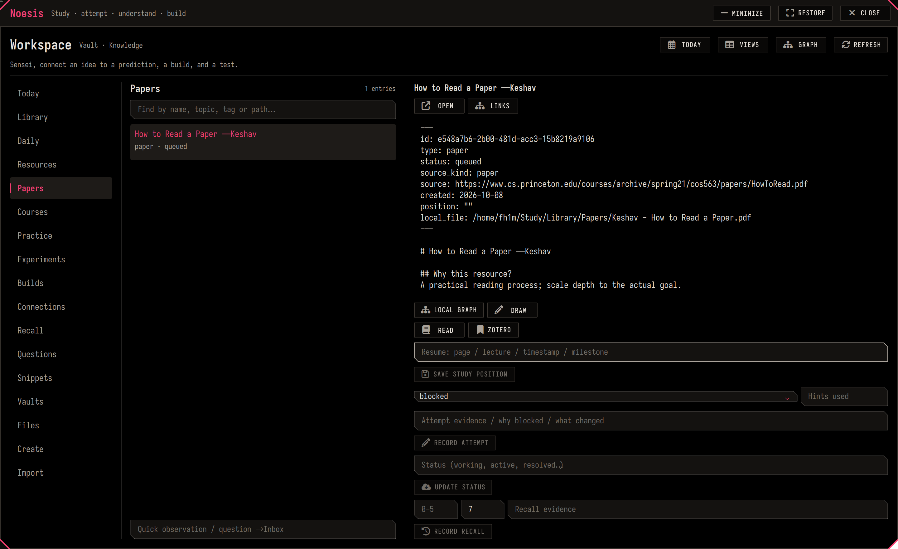

# Noesis

**Study → attempt → understand → build → revisit.** A connected learning workspace, not another pile of tabs.



## Start

```sh
noesis                         # persistent main-display window
noesis init "Control Theory"   # private local vault; refuses existing paths
noesis doctor                  # files, links, settings and real Obsidian CLI
noesis use /path/to/vault       # unlimited independent vaults
noesis today                   # native daily note
```

Default home: `~/Study/Obsidian/Knowledge`. Existing Workbench, Noesis robotics and
How Sand Becomes Magic vaults remain independent. The CS vault still lives at
`~/Study/Obsidian/Learning/how sand becomes magic`; its old Downloads path is a
compatibility symlink. Workbench is an engineering studio, not a course catalogue.

**Super+Ctrl+O** raises Noesis. The lower-bar Noesis entry does the same. Changing
focus does not close it. Drag the header, resize using the existing Hyprland
window controls, or use its minimize/expand/close buttons. Geometry is local state.

Neovim: `<leader>ow` opens the window; `oo` home, `of` frontier, `od` today,
`oc` capture with code/commit context, `os` search, `ob` backup. Visual `<leader>og`
captures selected code with provenance. Coding stays in your current environment;
these actions do not enter or replace a container.

## Flexible by construction

New vaults use `Notes`, `Inbox`, `Daily`, `Maps`, `Templates`, `Views`, `System`
and `Attachments`. Those are convenient storage defaults. Write elsewhere with
`noesis new note "An idea" --folder "Any structure"`, or move notes in Obsidian.
Obsidian updates internal links; stable record IDs survive renaming and moving.
No metadata is required for an ordinary free note.

| Work | Record |
|---|---|
| Read a paper, book, article, docs or lecture | Resource, source locator, reading goal and resume position |
| Follow a course | Materials and assignments; consumption and capability tracked separately |
| Solve a hard problem | Independent attempts, hints, blockers, explanation and later retry |
| Implement a model | Build, code/environment, tests and measurable evidence |
| Test hardware or simulation | Prediction, apparatus, units/frames/time, controls, raw results and uncertainty |
| Learn a mechanism | Concept, derivation, trace, counterexample and reconstruction |
| Keep a useful fragment | Snippet with source, assumptions and where verified |
| Correct a model | Error/misconception with its original reasoning preserved |
| Remember what matters | Reconstruction evidence and a learner-chosen revisit |

Prerequisites are **gate**, **parallel** or **deep descent**. Ordinary connections
may cycle; prerequisites must not become an endless queue before an interesting build.
Confidence is self-reported 0–5, supported by evidence. A reading count is never a
mastery score. Future branches park curiosity without inflating the current gate.

## Papers and documents

Zotero owns references and original annotations. Sioyek is the focused PDF reader.
Obsidian owns your explanations, linked concepts, attempts and experiment records.

```sh
noesis resource "A paper" --kind paper --url https://example.org/paper \
  --file /path/to/paper.pdf --why "What this helps me do"
noesis read-resource "Notes/A paper.md"
noesis progress "Notes/A paper.md" --position "Section 3, equation 8" --state active
noesis attempt "Notes/A problem.md" --result blocked \
  --evidence "I cannot justify the invariant" --hint none
noesis review "Notes/A concept.md" --confidence 3 --days 7 \
  --evidence "Solved a familiar instance; transfer still failed"
```

Zotero: save references with its browser connector or Add by Identifier; export
references as **CSL JSON**. Create a note from PDF annotations and export that note
as **Markdown**, retaining its exported image files beside it.

```sh
noesis import-csl /path/references.json --dry-run
noesis import-csl /path/references.json
noesis import-notes /path/export.md --resource "Notes/A paper.md"
```

Imports deduplicate identifiers and find renamed notes. Annotation imports own only
`Attachments/Imports/<record-id>/annotations.md`; a single embed is appended to
your note through the native CLI. Re-imports preserve your synthesis and keep previous generated excerpts.
Use the Import section and native file picker for the same operations.

Zotero annotations live in its database. **Export a PDF with embedded annotations**
when you want them visible in Sioyek; the two annotation stores do not magically
synchronize. Sioyek: `:` command search, `t` contents, `/` search, `F9` fit width,
`Alt+Left/Right` navigation history, bookmarks/highlights/portals via command menu.
The selected stable release uses bundled Qt 5/XWayland; Zotero and Obsidian use
native Wayland. Global Ctrl+arrow media shortcuts remain intact.

The official readers are pinned user-local releases, with inspected checksums:

```sh
python scripts/setup-learning-readers.py          # show plan
python scripts/setup-learning-readers.py --apply  # idempotent install
```

No OS-wide upgrade is performed. Zotero 10.0.6 and Sioyek 2.0.0 were installed this
way because the machine's stale CachyOS Zotero package URL returned 404.
The archived Obsidian Zotero Integration plugin is not a required dependency.
Browser connector/Web Clipper installation is a browser action, not silently enabled.

## Use Obsidian fully

Core **Properties + Bases** expose actual work. Canvas arranges models, Markdown
notes and evidence spatially; backlinks/local graph expose relationships.
LaTeX, Mermaid, PDF/image/audio/video embeds, bookmarks and daily notes stay native.
The installed Excalidraw plugin can be reused for freehand drawing; the factory
requires no community plugin. Open `System/Obsidian Field Guide.md` in a new vault.

Agents should teach and challenge your model, not ghostwrite an encyclopedia.
Their automatically discovered `AGENTS.md` asks for predictions, concrete traces,
assumptions, counterexamples and real experiments. AI drafts go to Inbox; they do
not become learner evidence merely by being generated.

## Backup and recovery

A private daily systemd timer snapshots managed vaults. `noesis backup` takes an
immediate vault snapshot; `sensei-learning-backup --all` also backs up reader data.
Archives/checksum manifests live under `~/.local/state/sensei-learning/snapshots`.

```sh
sensei-learning-backup --restore /path/to/snapshot.tar.gz --dest /NEW/vault/path
```

Restore checks checksums and refuses an existing destination. Plugin binaries,
workspace/session files, caches, credentials and large generated runs are excluded.
Vault Git history is preserved in the original migration backup, not each note snapshot.
Reader snapshots use SQLite's backup API and integrity checks. If Zotero holds an
exclusive lock, its last internal `.bak` is used and timestamped explicitly; close
Zotero and rerun for a fresh database snapshot. Its full-text cache is rebuildable
and omitted. Reader restore is documented in each manifest: close the app, verify
hashes, restore into a **new** data directory. Never sync a live Zotero database
with Syncthing. Local snapshots do not protect against losing the disk; an off-device
trusted destination remains optional and unconfigured.

## Implementation and undo

Dotfiles manage the factory, helpers, QML, reader defaults, launcher and additive
Neovim/Hyprland integration through the existing rendered `home/` installer.
Private subject material is not published. Update the maintained factory for new
vaults; upgrades to existing vaults are additive, with backups and no prose replacement.

Noesis reuses Obsidian's live metadata index. A Linux filesystem watcher runs only
while its window is open; refreshes are debounced, previews fetched on demand and
lists virtualized. No browser frontend, permanent indexing daemon or idle scanning.

To undo: restore the task's deployment backup; remove the Noesis window invocation
from `shell.qml` and its bar action/Hyprland binding; disable
`sensei-learning-backup.timer` if desired. Keep your vaults. Reader wrappers and
versioned directories can be removed independently; they are not your library data.

Troubleshooting: `noesis doctor`, enable Obsidian's native CLI, select an exact vault
path, then retry. Imports need a real CSL JSON array/Markdown export. Reader actions
need `source` or `local_file`. Busy actions expose cancellation without erasing inputs;
a cancelled multi-step action may have completed a write—refresh before retrying.

[Research and tradeoffs](research.md) · [Implementation ledger](PLAN.md)
