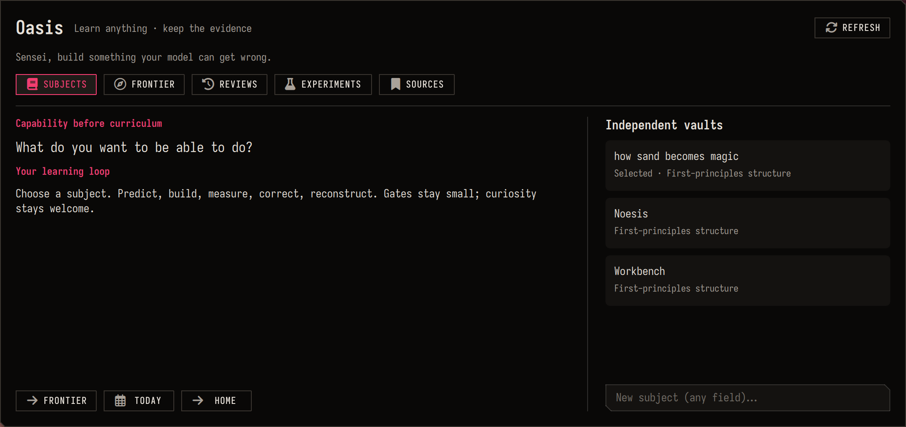

# Oasis

**Choose a capability. Predict. Build. Measure. Correct. Reconstruct.**



Oasis is a subject-independent learning workflow backed by ordinary Markdown and
Obsidian's native CLI. CS is one vault; robotics, mathematics, biology or your
next obsession are equally valid. There is no vault-count limit.

## Start

```sh
oasis init "Control Theory" --goal "Build and test a stabilizing controller"
oasis vaults
oasis use "$HOME/Study/Obsidian/Engineering/Workbench"
oasis frontier
oasis new concept "Feedback"
oasis new robotics-experiment "Timestamp and frame sanity"
oasis new paper-reconstruction "Reconstruct the estimator"
oasis today
oasis capture "My prediction failed; check the timebase"
oasis due
oasis doctor
oasis backup
```

`init --dry-run` previews; `--dest PATH` chooses a location; `--no-git` skips
local Git initialization. Existing destinations are refused. Nothing is published.
`oasis adopt --vault PATH` backs up and adds structure to an existing vault without
overwriting its files. Existing template-folder settings stay in place.

## Where things belong

| Area | Job |
|---|---|
| Home / Frontier | Capability, current question, gate and next experiment |
| Foundations / Courses | Operational prerequisites and paths |
| Labs / Concepts | Evidence and durable explanatory models |
| Questions / Errors | Open gaps and preserved failed predictions |
| Sources / Visuals | Resources with a purpose; dependency Canvas |
| Reviews | Reconstruct, derive, trace or transfer without looking |
| Projects / Real World | Runnable capability tests and deployed reality |
| Future Branches | Valuable curiosity that does not block today's build |
| Inbox / Daily | Raw material and working observations |
| Templates / Bases / Meta | Reusable prompts, useful views, protocol |

**Gate:** the minimum understanding needed for the next meaningful build.
**Parallel:** learn it alongside the build that makes it concrete.
**Deep descent:** explore the layer below when it helps; it is not prerequisite debt.
Dependency roles belong to a path/build; a skill can have a different role elsewhere.

Confidence: 0 seen · 1 recognize · 2 repeat · 3 familiar problem · 4 derive/predict
· 5 build/debug/transfer. Record actual evidence. Agents do not award mastery.

## A small daily loop

Open Frontier. Set its visible `question`, `next_experiment` and `active_project`
properties; these are also the panel readouts. State a prediction. Repair one small gate or run one test. Keep the
raw observation and failed model. Extract a concept only when useful. Reconstruct
one due item. Update the next experiment. Stop collecting pages as a proxy for skill.

Sources record **why useful**, the question/build served and what was verified.
Experiments separate proposed setup, observations and interpretation. Reviews
rebuild a mechanism, derivation, state trace or diagram; not merely rereading.
ML, robotics, software and paper-reconstruction templates give domain-specific
checks without inventing outcomes. Agent instructions live in every vault's
`AGENTS.md`; unprocessed agent text belongs in Inbox/Agent Drops.

## Daily-driver integration

- Lower-bar **Oasis**: Subjects first; choose any vault or create a new subject.
  Frontier, review, experiment and source views read the active vault's real state.
  No background polling loop or separate database.
- Launcher: **Oasis**. `Super+Ctrl+O`: active Frontier.
- Neovim `<Space>oo` home, `of` frontier, `od` daily, `oc` capture with code context,
  `os` knowledge search, `ob` snapshot. `:Oasis frontier` also works.
- Existing Neovim knowledge/project tools and vaults remain available independently.
- tmux `Alt+Shift+Left/Right` changes windows; ordinary Shift arrows reach agents.
  History is 200,000 lines. This cannot manufacture past text an application never
  emitted into terminal history.

The bridge resolves vault IDs and verifies their exact paths; duplicate vault names
cannot silently send an action to the wrong archive. Native CLI handles creation,
search, daily notes, tasks, properties, Bases and navigation. `oasis cli help` exposes
all installed commands. Capture uses the CLI's eval plus Obsidian's vault API to
preserve literal code escapes. New-vault registration uses the app's inspected
vault-chooser IPC through CLI eval; that one internal bridge may need adjustment
if Obsidian changes it. It refuses unsafe registry rewriting while the app runs.

## Backup / portability

A low-priority persistent user timer snapshots registered structured vaults daily.
Local snapshots live in `~/.local/state/sensei-learning/snapshots` with private
permissions, checksums, seven recent snapshots plus four weekly representatives.
Unchanged content is skipped. Plugins, workspace state, caches and `.git` are
excluded from daily archives. Your existing Git history remains in each real vault;
the initial migration backup includes the original history and installed plugins.

```sh
systemctl --user status sensei-learning-backup.timer
sensei-learning-backup --all
sensei-learning-backup --restore /path/to/snapshot.tar.gz --dest /new/restore/path
```

Restore verifies checksums and refuses an existing destination. These are **local
backups**: protect against editing mistakes, not laptop/disk loss. Syncthing is
already available; configure an explicit trusted second device for off-device
copies. Never automatically publish private notes. Use normal Git for intentional
subject milestones; generated vaults have no remote and no automatic commits.

Reusable template/scripts/UI/defaults belong in dotfiles; subject notes stay in
vaults; app registry/session state stays local. Installer `scripts/install.py`
renders the existing `home/` tree. The full installer was tested only in temporary
HOME; live deployment used targeted task files to preserve unrelated changes.

To update: edit the maintained template, run `tests/test_learning.py` and
`scripts/test-install.py`, then deploy the changed reusable files. Existing vault
notes are not bulk overwritten by a template update. To undo: disable the timer,
remove Oasis launcher/helper/UI hooks, remove the Neovim additive plugin, and use
the private pre-change backup if restoring original settings. Vault content remains.

## Troubleshooting

`oasis doctor --vault PATH` checks structure, YAML, critical links, dependency cycles,
Canvas references, Bases YAML, configured paths, tracked volatile state and actual
native CLI identity. Intentional unresolved concept links are warnings; broken Home
navigation is an error. `--offline` skips the running-app check.

Enable Obsidian Settings → General → Advanced → Command line interface. Existing
vaults can be opened independently; use `oasis use PATH` to select. If an app upgrade
breaks registration, the newly generated notes remain safe; open that folder via
Obsidian's vault chooser. Do not hand-edit the registry under a running application.

[Research and adaptations](research.md) · [Execution ledger](PLAN.md)
