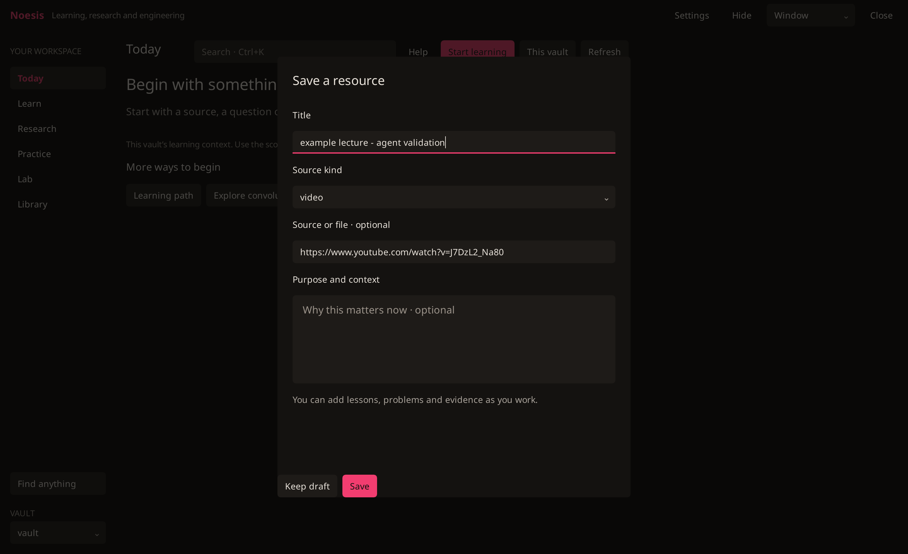

# Noesis user guide

The single maintained guide is [Learning with Noesis](../../home/.local/share/sensei-learning/ui/user-guide.md), installed with the application and available through **Help**. Its verification boundary identifies unfinished acceptance.

Native self-service walkthrough:

1. Open Noesis from the Wrayth bar. Choose **Start learning** (or Ctrl+N).
   
2. Paste a source, choose its format and supply your own title. **Continue → Save**.
   
3. Work in the source page; preserve notes/questions and reading position.
   
4. Close and reopen: the owned activity is restored.
   

These captures use disposable, agent-labelled data. They do not demonstrate owner learning or all specialist round trips.
