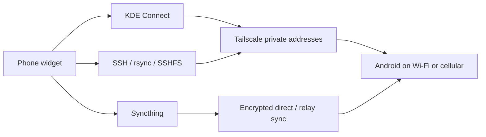

# Phone: local convenience, private internet reachability

[← Workstation](../README.md)


The reference phone is a Samsung A52. The design separates features from transport: KDE Connect provides clipboard/files/notifications/control, Tailscale provides a private path across independent networks, Termux provides authenticated commands/files, and Syncthing handles deliberate folder sync. None grants Android root or unrestricted access to app-private data.



## Pair and connect

1. Install KDE Connect and Tailscale on the phone. Sign both devices into the same authorized Tailscale network.
2. Enable relevant KDE Connect Android permissions; pair and accept on the phone.
3. Add the laptop’s private Tailscale IP to KDE Connect’s devices-by-IP list. Configure the phone’s private IP on the laptop as needed.
4. On Samsung, set KDE Connect/Tailscale/Termux to Unrestricted and Never sleeping. Configure Always-on VPN only if it fits your other VPN requirements.
5. Test while phone Wi-Fi is off and mobile data is on. A paired LAN socket is not proof of a cellular-only session.

The bridge listens for network/phone events and retries discovery while a paired phone is unreachable. Radio handoff can still introduce a gap. Always-on VPN and battery exclusions help; they do not override absence of internet or every Android process restriction.

## Termux and keys

Install Termux and Termux:Boot from the same official source; open Boot once. In Termux:

```sh
pkg update
pkg install openssh rsync syncthing
termux-setup-storage
whoami
passwd
sshd
```

Use your actual Termux username, not the reference machine’s ID. Create a dedicated laptop key and install its **public** half in the phone’s `~/.ssh/authorized_keys`:

```sh
ssh-keygen -t ed25519 -f ~/.ssh/sensei_phone
ssh-copy-id -i ~/.ssh/sensei_phone.pub -p 8022 TERMUX_USER@PHONE_TAILSCALE_IP
```

Verify the host fingerprint before accepting it. Copy the `.config/sensei-phone.json.example` template to `~/.config/sensei-phone.json`, set your phone address/user, and keep it private. No password or private key is distributed.

The example Termux boot script starts sshd and Syncthing if absent. Syncthing’s GUI binds to loopback, not public HTTP. There is no permanent wake lock. Test a real phone reboot: installing Boot is not proof its receiver ran.

## Files, commands and sync

The widget offers KDE file transfer, Taildrop, rsync upload, SSH commands and user-initiated SSHFS browsing at `~/Phone/Browse`. SSHFS uses keepalive/reconnect. Mount detection reads `/proc/self/mountinfo` rather than statting a potentially blocked offline FUSE path.

Recommended folder distinction: `Transfers` bidirectional, `Models` laptop-send-only / phone-receive-only with versions. Configure actual device IDs through Syncthing; the repository contains none. Check free space on the phone before enabling model sync. The reference phone was nearly full, so model sync stayed paused; no personal files were deleted to make room.

Remote API work uses short-lived private SSH tunnels. Keep GUI credentials/API keys private. Android shared storage may need `ignorePerms`; version retention and absolute free-space reserves should match your capacity. Full configuration writes must preserve nested settings; a partial update can otherwise reset related fields.

The laptop/phone key command and tiny transfer tests passed over the private path. An authenticated sustained cellular-only KDE feature test and actual phone boot recovery remained pending in the historical notes. Do not present them as proven merely because SSH worked.

## UI behaviour

Nine tabs: overview, clipboard, files, notifications, calls/SMS, control/SSH, sync, connection and setup. Content is loaded lazily; notification rows are virtualized; drafts survive tab changes; queues and timeouts are bounded. Push snapshots cannot be overwritten by older telemetry results.

Calls/SMS actions depend on Android permissions/version and KDE Connect plugin support. scrcpy/ADB requires explicit debugging authorization; it is not a silent phone takeover. Tailscale does not remove those permissions.

Sources: [KDE Connect](https://userbase.kde.org/KDEConnect/en), [Tailscale Android](https://tailscale.com/docs/platforms/android), [Termux:Boot](https://github.com/termux/termux-boot#usage), [Syncthing REST config](https://docs.syncthing.net/rest/config.html).
