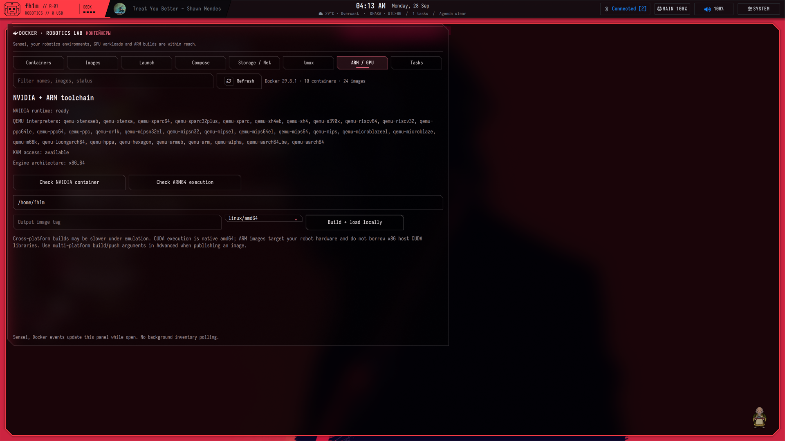
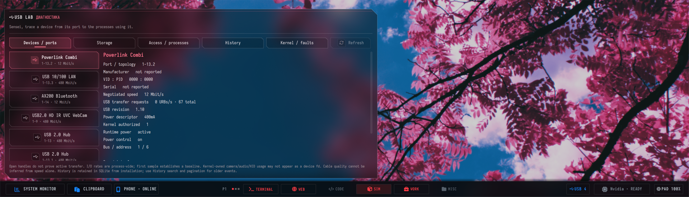

# Robotics: containers, ARM, tmux and USB

[← Workstation](../README.md) · [GPU placement](gpu-and-chrome.md)



## Environments that can be inspected

Start at System → Robotics → Docker robotics lab. Inventory never starts an existing container. A shell request for a stopped container explicitly starts it; a launch creates a named container in a new tmux window. The tmux session can outlive the terminal window.

Use separate environments for documentation, ROS bring-up, simulations and model training. The launch form makes workspace mounts, ROS_DOMAIN_ID, host networking, shared IPC, serial passthrough and GPU use visible choices. It does not make every container privileged or mount the entire host filesystem by default. A mounted project is writable inside the container; select the intended directory.

## NVIDIA runtime and stale CDI paths

After installing Docker and the NVIDIA Container Toolkit, follow its [current configuration instructions](https://docs.nvidia.com/datacenter/cloud-native/container-toolkit/latest/install-guide.html). The reference daemon has an NVIDIA runtime available. Regenerate the CDI device specification after driver/library changes:

```sh
sudo nvidia-ctk runtime configure --runtime=docker
# A Docker restart affects running containers: plan it deliberately.
sudo systemctl restart docker
sudo nvidia-ctk cdi generate --output=/etc/cdi/nvidia.yaml
nvidia-ctk cdi list
docker run --rm --gpus all nvidia/cuda:12.8.1-cudnn-devel-ubuntu22.04 nvidia-smi
```

The workstation failed a real launch because `/etc/cdi/nvidia.yaml` still referenced a missing earlier `libnvidia-egl-wayland` filename. Regeneration fixed it. The root examples include a boot oneshot and a pacman post-update hook. Prefer the toolkit’s packaged refresh units when available; avoid two conflicting specs for the same device. [NVIDIA CDI lifecycle](https://docs.nvidia.com/datacenter/cloud-native/container-toolkit/latest/cdi-support.html).

A GPU name is necessary but not a complete compute test: the verification also compiled and ran a CUDA kernel in a disposable container. Existing user workloads were not started, removed or interrupted to test UI buttons.

## ARM containers

```sh
sudo pacman -S --needed qemu-user-static qemu-user-static-binfmt
sudo systemctl restart systemd-binfmt
cat /proc/sys/fs/binfmt_misc/qemu-aarch64
docker run --rm --platform linux/arm64 alpine:latest uname -m
```

Expected result is `aarch64`; inspect registration flags if cross-builds fail. Static user-mode QEMU lets ARM binaries run within a container on the x86 host. It does not provide a complete robot board, kernel, peripheral model or native x86 NVIDIA CUDA inside the ARM image. Emulated builds can be slow; use native cross-compilation or the target hardware where appropriate.

## tmux workflow

Docker lab → Tasks includes an experiment cockpit. Set the project directory in Launch, enter a name and command, then choose **Record run**. It saves the exact command, Git commit/dirty state, duration and combined output under `~/.local/state/sensei-lab/`. **Open project** resumes its named tmux session in that directory. Nothing samples or starts in the background.

```sh
sensei-lab run --project ~/ROS_workspaces/my_ws --name lidar-baseline -- colcon build
sensei-lab list
sensei-lab open --project ~/ROS_workspaces/my_ws --name lidar-baseline
```

```sh
# UI launch form can create this session/window instead.
tmux new-session -s robotics -n bringup
docker compose -f examples/compose.robotics.yaml run --rm robotics
# Detach / choose windows using your actual tmux prefix and bindings.
```

`examples/compose.robotics.yaml` is a native CUDA development example, not a complete preinstalled ROS image. Choose or build your ROS distribution explicitly. `examples/robotics-bringup.py` is an illustrative ROS 2 heartbeat publisher, shown as code in the gallery; it is not a fabricated live robot test.

The reference tmux configuration uses custom bindings and rounded end caps with a uniform red status language, dim inactive windows and numbered sessions. Check `.tmux.conf` for the effective prefix; an upstream hint saying Ctrl+B may not match a personalized prefix. Sessions retain their actual names.

## USB and serial debugging



The USB panel combines udev history, current devices, interfaces, attached nodes, speed/topology, owners/groups/permissions, mounted capacity and process/activity information where permissions allow. Root audit support is optional and separate from the unprivileged inventory. A missing value is not replaced with a fake number.

Use device identity and stable paths when choosing a serial port. Pass only the required node into a container; consider the container user/group, host permissions and competing processes. Some debugging steps require appropriate privilege:

```sh
ls -l /dev/serial/by-id/
udevadm info --query=property --name=/dev/ttyUSB0
fuser -v /dev/ttyUSB0
journalctl -k -f
lsusb -t
```

The panel can reveal a disconnected/re-enumerated port, access mismatch or process holding a node. It cannot infer every electrical fault, cable problem, USB bandwidth issue or robot firmware bug from software alone. Resetting devices and changing permissions should remain deliberate operations.

## Training mode boundaries

Turning Training on saves the chosen Chrome graphics mode and uses Intel for managed graphics launches; leaving it restores the prior choice. Performance/keep-awake is preserved for training. Already-running unmanaged NVIDIA applications are not automatically migrated or killed. CUDA remains available, and a NVIDIA-wired external display can still occupy the GPU.

The advanced Docker field accepts arguments without evaluating shell operators. It covers less-common explicit operations such as tags/push, network create/connect, volume creation, container resource updates, rename and buildx publication. Review destructive CLI arguments yourself; graphical remove/kill actions use a two-click confirmation.
